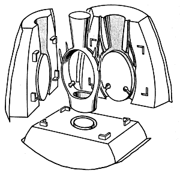

Seldom have I been so keen to rush home and Google something. We were on a weekend jaunt away, and what with one thing and another found ourselves driving between Sansepolcro and Arezzo with a Los Angelena in the back seat. We were giving her a ride to the station, and exposing her to a bit of the old art, and frankly the least said about that, the better. Anyway, at a certain point she leans forward, strokes The Squeeze on the upper arms and starts in on about Cuddle Parties.

 Excuse me? WTF?

She did a bit of explanation, but it didn’t seem to amount to much. Non-sexual intimacy, the human need for human touch, that kind of thing. We asked for details, but all we got was the notion that someone -- a facilitator, no less -- puts an ad on the internet and people come, usually lots of younger guys. Well, yeah.

Then the conversation veered off, much as I nearly had on the very drivable road when she first raised the subject, and we kind of dropped it.

Hence the need to rush back and seek [details](https://cuddleparty.com/), which really are barely [worth sharing](https://web.archive.org/web/20110629140701/http://www.mcsweeneys.net/articles/rules-for-my-cuddle-party). It is [exactly what you might expect](https://en.wikipedia.org/wiki/Cuddle_party), perhaps the only novelty being that it originated in NYC rather than LA.

And then we were telling the story to a somewhat English friend. It seemed to me that she didn’t see the hilarity of it all, or wanted to attend, or had attended (?) or something. In any event, the reaction was frostier than I expected. Until ...

“A cuddle party? Cuddle? I thought you said cuttle.”  
“But that's crazed. What would a cuttle party be?”  
"I don't know. That's why I couldn't work it out.”

And then she told us all about [cuttlefish casting](https://www.ganoksin.com/article/cuttlefish-casting-method/), of jewelry.

It was that kind of weekend.
