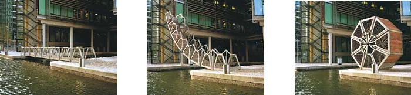

I used to live in Paddington, and not much would tempt me back. A new [footbridge](https://web.archive.org/web/20050211092639/http://archrecord.construction.com/features/digital/archives/0412dignews-3.asp), however, must certainly be worth a visit.  It rolls into a wheel.

{.center}

There’s something about bridges and art and architecture that finer minds have almost certainly written about. But what with the Millennium Shaft of Light and the wonderful [Campo Volantin](http://www.greatbuildings.com/buildings/Campo_Volantin_Footbridge.html) footbridge in Bilbao (both of which I have had the pleasure of using) and that new world’s tallest thing in France (which I haven’t), bridges have a definite power to captivate.
