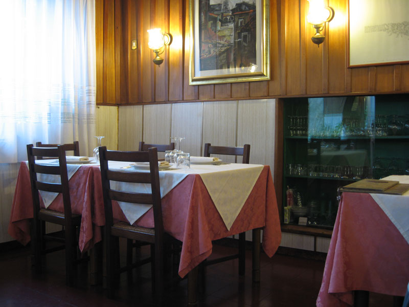
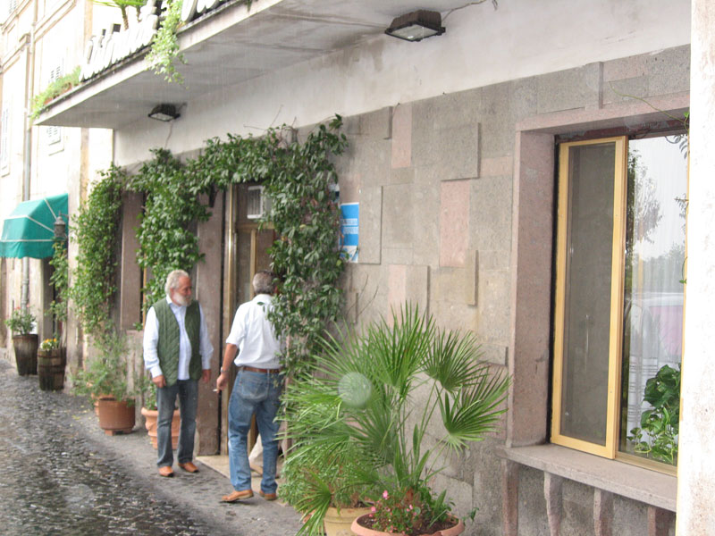

It was rainy, the first wet day of autumn that wasn’t also a work day. We were away on a weekend jaunt, just up the coast a little. Not far enough, really. The Squeeze said it felt like an affair, being away and in a hotel but less than an hour from home. And after the stunning storm of the night before, through the bouts of rain we headed off into the hills to have some fun.

After a couple of hill towns and some excellent wet curves we came to the little town of Ronciglione, which we deemed large enough to be able to feed us lunch. Parked, started to stroll down the main drag. Many, many bars, all of them a little sad in the dripping rain. On we walked, but found no trace of anything that might serve more than a sandwich or microwaveable pasta. Eventually we reached one of the town gates, and were about to give up and see if the medieval section might have something more to offer than history. For some reason I walked on a little further, and just outside the gate was the Ristorante Stella.

{.center}

Totally unprepossessing, very homely sixties decor, and we were the only people inside. But the proprietor, who was also the chef, made us very welcome and the sweet musty smell of porcini mushrooms filled the air. We ate. A shared dish of tortarelli with fungi porcini was sublime, the mushrooms slithery but with enough bite and packed with flavour. Then scallopini; with porcini for me, tartuffo nero for The Squeeze. Again, just a little meat, with just a little sauce, but perfectly balanced. A fair bit of black pepper and probably a little butter mixed with the oil they had been cooked in. On the side, beans in olive oil -- again the black pepper much in evidence -- and cichoria, and again something just a little different to put it beyond the realm of the ordinary. I thought the cichoria had been cooked with a little broth, but we were assured that they were quite plain. If so, they were more than plainly good.

The owner was happy for us to drink only a single glass of the local red, which was also good, and utterly unobtrusive. All the cooking took place in a minuscule kitchen to one side of the main dining room and in full view. I couldn't see what was going on, perhaps I should have changed seats, but I found myself wondering how on earth he copes with a full crowd. I counted at least 28 covers in our room, and there was another room. I'd be willing to bet that there are times when the entire place is occupied.

{.center}

All in all, a wonderful find. I suspect we may well go back. So if you're ever in Ronciglione, in need of a meal, seek out the Ristorante Stella, viale Garibaldi 118, 01037 Ronciglione, 0761 625066. Best of all? Given its name, one might think the restaurant a bit full of itself, but no. The owner’s name is Roberto Stella. He deserves it.
