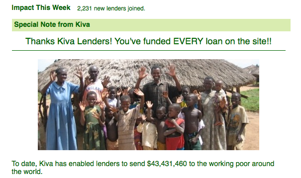

{.center}

Ok, it’s only USD43 million, a pittance compared to [losses in the US financial sector](http://www.nytimes.com/interactive/2008/09/15/business/20080916-treemap-graphic.html). But still, quite an achievement for [Kiva](http://www.kiva.org/app.php?page=businesses). All, I suspect, the result of making partial repayments available for immediate re-lending. I know I’ve been looking for a project to lend to for the past couple of weeks, to no avail. It’s bad enough that there are so few projects under Agriculture. But no projects at all? Amazing.
