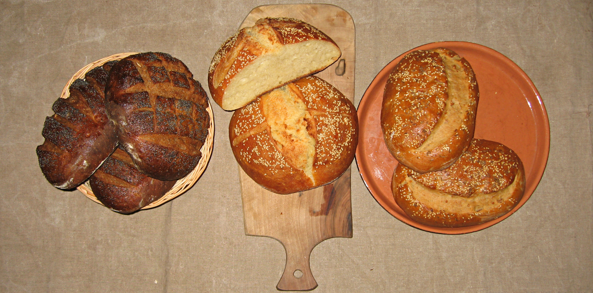

{.center}

Invited to a New Year’s Eve party, and told to bring something to eat, no hesitation: breads. Left to right, they are [black pepper rye](https://www.fornacalia.com/2017/black-pepper-rye/) from Dan Lepard, 50% durum:manitoba sourdough, and [peanut chilli](https://www.guardian.co.uk/lifeandstyle/2010/aug/07/peanut-chilli-bread-recipe-lepard), a new one from Dan Lepard.

Absolutely no hesitation in making this the first post of 2011 either. Baking better breads has been one of the most satisfying, rewarding and fulfilling things I’ve done in 2010 and I hope to build on and expand all that in 2011.

I’ve learned so much in the past couple of years, since I started baking again in earnest; techniques, chemistry, physics and shopping. I’ve gained the confidence to manipulate recipes and sticky, tricky doughs. I’ve delighted in the accompanying emotions and the end products. Whom to thank? Everyone on the few bread sites I frequent, so unstinting in their sharing. My customers (you know who you are), whose praise and willingness actually to pay money for something I do for love somehow increases the emotional value of the transaction, rather than cheapening it. And The Main Squeeze, for absolutely everything.
