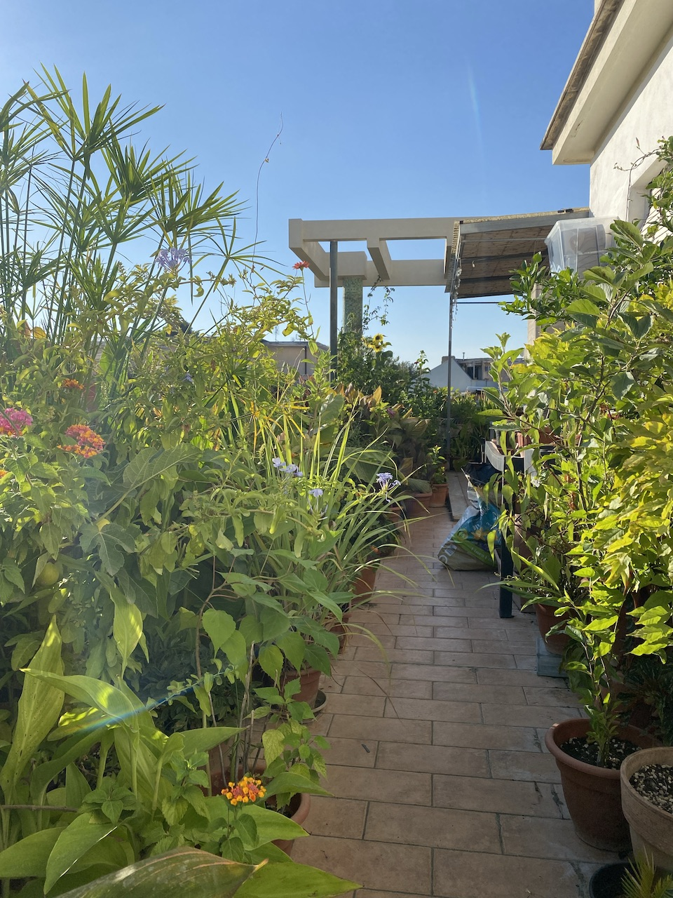
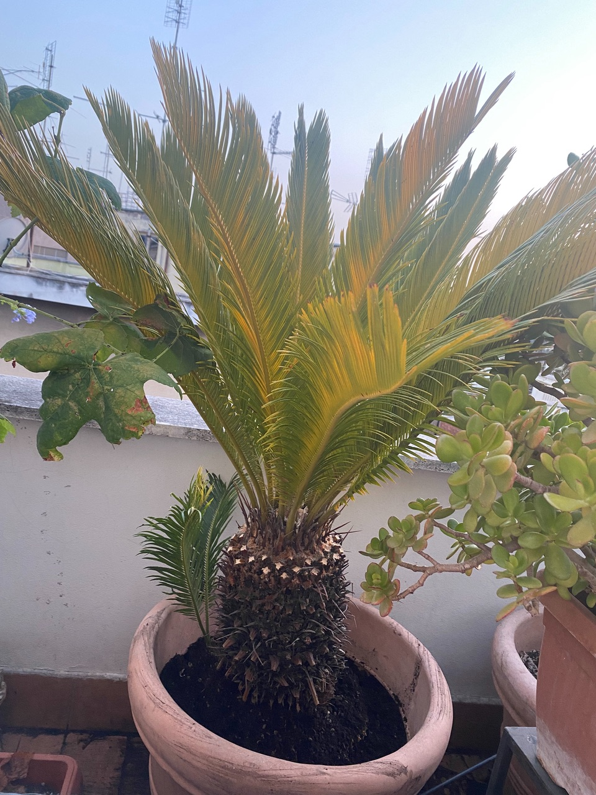
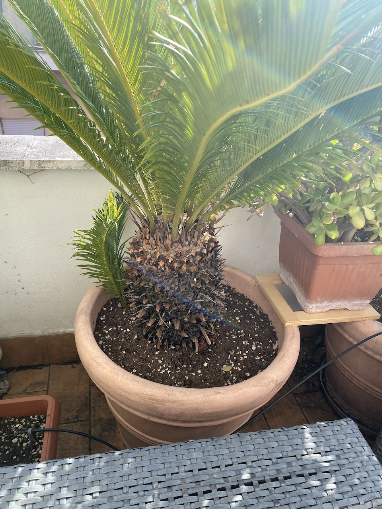

I no longer have a garden. I used to have one, in spades. Almost two hectares of old apple orchard, a large polytunnel, raised beds for veggies, flowers galore, a pond big enough to dip into after a hard day’s work. All gone, for reasons that needn’t detain us now, and that I try hard not to think about any more.

Instead, I have a terrace, which is actually much more densely packed with plant life than any similar area of my real garden ever was. At base, the reason is that I now live in a city, and a continental city at that, where there are very few single occupancy dwellings and even fewer gardens.[^1] So it is a terrace or nothing, and nothing would be unthinkable.

{.center}

[^1]: The human density of a well-designed city is part of its attraction of course, and we do have a lovely large park nearby; without the terrace and the park, I wouldn’t be able to live here.

Plants in containers pose all sorts of problems that ones in soil do not. Perhaps the greatest is water. In the soil, roots can go off in search of water and if you choose the right plants for the place they’ll be able to cope with almost anything without needing extra water most of the time. In a pot, either you, the human, get it right or the plant dies. Well, maybe it doesn’t die, but it doesn’t do very well. Either way, it is sobering. If you have endless time, then of course you can do all your watering by hand, giving each pot what you judge it needs and going on holiday only in the winter when things should be OK without daily attention.

An automated watering system was almost the first thing installed when we moved in about 12 years ago. To begin with I tried to be efficient about it, with micro-drippers supposedly tailored to each pot. That kinda sorta worked most of the time, but it was also a huge mess with irrigation tubes snaking all over the place and making it difficult to rearrange the pots to make the most of whichever plants were doing best from moment to moment. Individual drippers are also impossible for smaller plants, because none drip sufficiently little water to avoid drowning the plants. I suppose a dual timer system could solve those problems, but a simpler solution was to add some micro-sprinklers to the system. They covered a reasonably large area, and I could place quite a lot of small pots under one sprinkler. 

That worked so well that I decided to created an all-sprinkler system. Alas, it was only after I had laboriously installed the whole thing that it became clear that much of the time the water pressure up here on the fifth floor wasn’t up to the job. Enter the sunk cost fallacy and a valiant attempt to make the system work by throwing money (and a modicum of technical ingenuity) at it. The result has been absolutely brilliant, and as it comes to the end of its third summer we have lost only a single rosemary bush, which drowned rather than going thirsty.[^2]

[^2]: [Pump up the pressure](https://www.jeremycherfas.net/blog/pump-up-the-pressure) chronicles the triumph and links back to the tribulations.

The other problem with pots, also compounded by being on the fifth floor, is the lack of anything resembling a functional ecosystem. As a result, when pests appear, they can quickly take over. No birds visit to pick off rose sawfly caterpillars. No ladybird larvae to chomp on aphids and the like. The only solution is eternal vigilance and, I regret to say, lethal chemicals. Woolly aphids, for example, are easy enough to see and to pick off and squish. But left alone for a day or two they can take over a lemon tree, for example, and the only practical solution is a combination of a spray and a systemic insecticide, which seems relatively safe as the lemons won’t be ripe for another couple of months. Scale insects are even worse. The Squeeze combines two attributes I lack —  hawkeye vision and a readiness to spray — that I am happy to accept as it keeps the plants much healthier than if I were in charge.

The final strange thing about plants in pots, especially perennials, is that harmful changes can kind of sneak up on you, because the changes are slow and you see them every day. About a month ago, for example, we came home from two weeks away and at first glance the watering system had performed perfectly and everything was alive. Alive, but ... A big cycad was looking terrible, leaves very yellow, infested with woolly aphids, utterly parlous. It had seemed fine up to that, but going away enabled us to see it with fresh eyes, and it was a disaster.

{.center}

It is a huge plant, which I can barely lift, and prickly as all get out, but I managed to manhandle it out of its pot to reveal it was totally root-bound, with pockets of some sort of fungus in among the roots. I cut off some of the biggest roots and tried to tease the rest out a bit before plonking it is a much bigger and somehow filling it with soil without getting pricked to death. I had done what I could for it. 

Just as it can be hard to notice a plant’s decline, so to it can be hard to when things have improved. A couple of days ago it seemed that the leaves were much greener. (I had chopped away a couple of the lower whorls, but even those left were not in great shape.) Was that possible? Fortunately, I had taken a photograph (above) to celebrate the repotting. So this evening I took another (below). And yes, it has definitely improved.

{.center}

Which is nice.

Of course there are other parts of gardening on a terrace that I’m not going to go into. One is the sheer cost of it. I’m very lucky to be able to afford pots and the several big bags of soil we need each year, and I actually spend almost nothing on plants. Indeed, I could probably recoup some of the expense if I charged for the cuttings I root rather than giving them away. And for years I’ve talked about a water feature, but I haven’t yet done anything about it. Maybe after the success of the pump, that will be my next big project. A half butt, a little solar-powered submersible sprinkler, a fish or two to eat the inevitable mosquito larvae. How hard can it be?

For all the work, the expense and the as-yet-unrealised dreams, I truly couldn’t live without the terrace. It was about the only thing that kept us sane during the early, harsh lockdown (when even the park was closed) and now it gives us so much more living (and breathing) room. It also gives me so many moments of joy, every single day, but that’s a topic for a different day.

! This post is a submission to [Gardening](https://marksuth.dev/posts/2023/08/indieweb-carnival-august-2023-gardening), hosted by Mark Sutherland for the the [IndieWeb Carnival](https://indieweb.org/indieweb-carnival). It’s my turn to host in September. I’ll announce the topic very soon.
