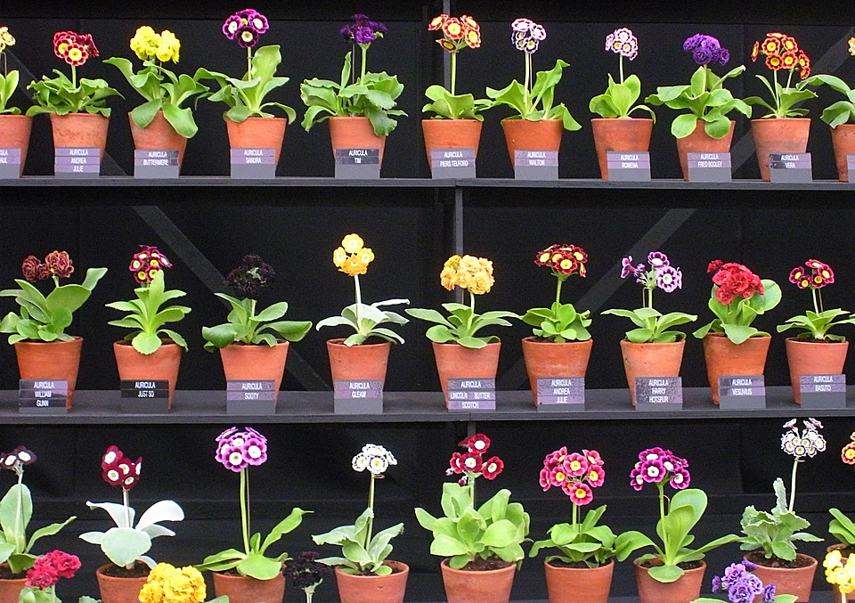

People have written some interesting things following on from the pop-up IndieWebCamp that Chris Aldrich organised a couple of weeks ago. [The Garden and the Stream](https://boffosocko.com/2020/04/26/a-short-post-mortem-video-and-note-links-and-challenge-from-the-garden-and-the-stream-indiewebcamp-pop-up-session/) set out to compare and contrast wikis and weblogs and how the two might be used. It was a terrific success, and I’m sorry I wasn’t able to be there. The topic interests me and is something I’ve thought about on and off for a long time. This morning, I treated myself to thinking about it some more.

===

I didn’t watch the recording of the session, but I did spend some time going through [the notes](https://indieweb.org/2020/Pop-ups/GardenAndStream) and reflecting on bits that caught my attention. I liked [Desmond](https://desmondrivet.com/)’s thought that a recipe could be a wiki entry ([Desmond’s recipes](https://wiki.desmondrivet.com/FindPage?action=fullsearch&advancedsearch=1&and_terms=&or_terms=&not_terms=&mtime=&categories=CategoryRecipes&language=&mimetype=) are), while a story about a recipe would be a blog post. I agree that the recipe might be tweaked from time to time, maybe to clarify the instructions or add optional deviations. Discovering the deviations, or adapting the recipe, or serving it on a particular occasion, would then be the blog posts. 

On [my bread and baking site](https://fornacalia.com), I don’t revise a recipe once written. If I change or tweak the recipe, that too becomes a blog post that contains a link to the original. Because the site is currently powered by WordPress, it wouldn’t be difficult to convert recipes from posts to pages, but right now I’m not yet seeing enough value in that.

Either way, though, the problem remains of informing anyone else who looked at the recipe before the changes. Is this on me, the recipe writer, or you, the recipe reader? It would be nice if Desmond could offer an option to subscribe to his recipe category, or to individual recipes. If I bring one of his recipes into my own collection, I would include the source. I could then check it manually or, if I were smarter, build something that automatically compares the current version to the version I originally linked to. My feeling is that it is up to me to keep myself informed about changes, and the best that Desmond could do is make that easier with a feed.

## Atomicity and Auriculas

As a gardener, I am torn between the blowsy attractions of an English herbaceous border in all its glory, and the perfection of a single bloom. It’s a false dichotomy, of course, but the discussion on atomicity brought it to mind.

[twMAT](https://github.com/twMat) noted that TiddlyWiki says that everything should be as small as possible. And yet, a page full of, oh, I dunno, [68 good thoughts](https://kk.org/thetechnium/68-bits-of-unsolicited-advice/) is terrifically absorbing to scroll through. Would I have got to No. 68 if I had to click from one to the next? No. So it is with notes and maybe flowers too. The smallest possible unit makes it easier to take care of each unit, but they really shine in the aggregate.

This is the principle of the zettelkasten, where each slip, or note, should ideally contain a single idea. The method’s strength is then is to allow those ideas to be chained together in different ways. I’ve not been very good at that, and I acknowledge that I am more of a hoarder than a curator when it comes to my zettelkasten, which only became one after I migrated from nvALT to The Archive a couple of years ago. Too often, when I go through my notes, I discover that I just copied a chunk of someone else’s ideas into my slip, unfiltered, unprocessed, and unlinked to any other thought. 

Nevertheless, the very fact that I am going through my notes reflects a new habit I am trying to build, of setting time aside every week, and sometimes more often, deliberately to tend the oldest notes I have and the notes I created or edited in the past week. Old notes take longer, because I have to check old links and decide what to do if they have rotted away. Those notes also need to be reshaped in line with zettelkasten principles. That means deciding on primary tags, considering internal links, splitting the atoms of long notes and so on. At times it frustrates me, but when it goes well I do see structure emerging and with it new thoughts and new directions to follow.

Unlike many of the wiki enthusiasts, at least on my reading, I have no interest in making my zettelkasten public, only the things that emerge from it.

## Stones in the Garden

[Anne-Laure Le Cunff](https://nesslabs.com/) raised the point that blogs are set in stone while a wiki consists of evergreen notes. That may be so, in an ideal world, and it prompts two thoughts. First, search engines do a really bad job of indicating the age of any web page. This is especially true for blog posts, and when you are looking to solve a problem it can be a real annoyance. Secondly, the evergreen nature of a wiki means that as it grows it casts bits of itself into the shade; some pages do just get neglected, not by design but by accident. As noted, I’m trying to overcome this by setting time aside specifically to expose older notes, but I’m sure that as the number of notes goes up, so the return time to any given note increases until it may as well be set in stone.

!!! Aside: I read [Stacking the Bricks: How the Blog Broke the Web](https://stackingthebricks.com/how-blogs-broke-the-web/) — undated, natch — with a knowing sense of been-there-done-that, because it is true. I built web pages by hand for a newsletter I used to publish physically. The pages had an image-mapped table that let you read past issues. For each new issue, I updated every file, by hand. I often made mistakes. So when I discovered NucleusCMS in 2001 or 2002 I was primed and ready to go. It changed my professional life entirely. But I’m still writing and publishing on the web in the way I always have: as dated pieces presented in reverse chronological order, even in filtered presentations. If there’s one takeaway from all this, it is that I want to think much harder about that.

The finest example I know of someone who tends their garden meticulously is [Gwern Branwen](https://www.gwern.net/). The home page is exactly what Amy Hoy would like, a table of contents, gathered under various useful headings. Each page is an extended article, with an estimate of how finished it is and various other metrics. The pages are beautifully laid out, easy to navigate, informative, astonishing. There is much there that I don’t begin to understand, and it is always a pleasure finding that out. Gwern remains an impossible lodestar for the kind of thing I now have in mind.

As it happens, I have a stream running through this, my garden. Or perhaps it is a side channel off the main river. Either way, a garden is invariably a nicer place to be when it has a water feature.

!! Huge thanks to everyone who contributed to the pop-up for helping me to think through some of these things. Photo of an auricula theatre by [Victoria Summerley](http://victoriasbackyard.blogspot.com/2012/05/chelsea-flower-show-2012-theres-nothing.html), used without permission but with credit.

