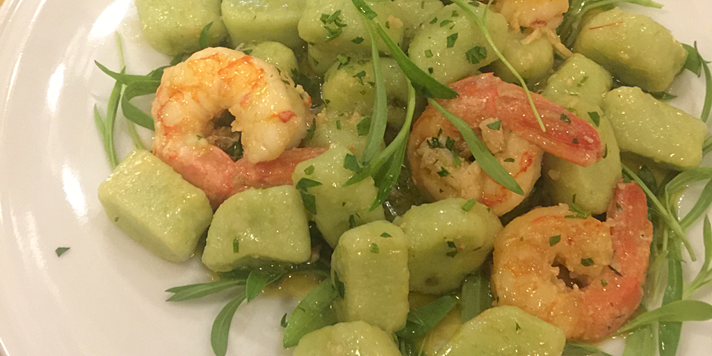
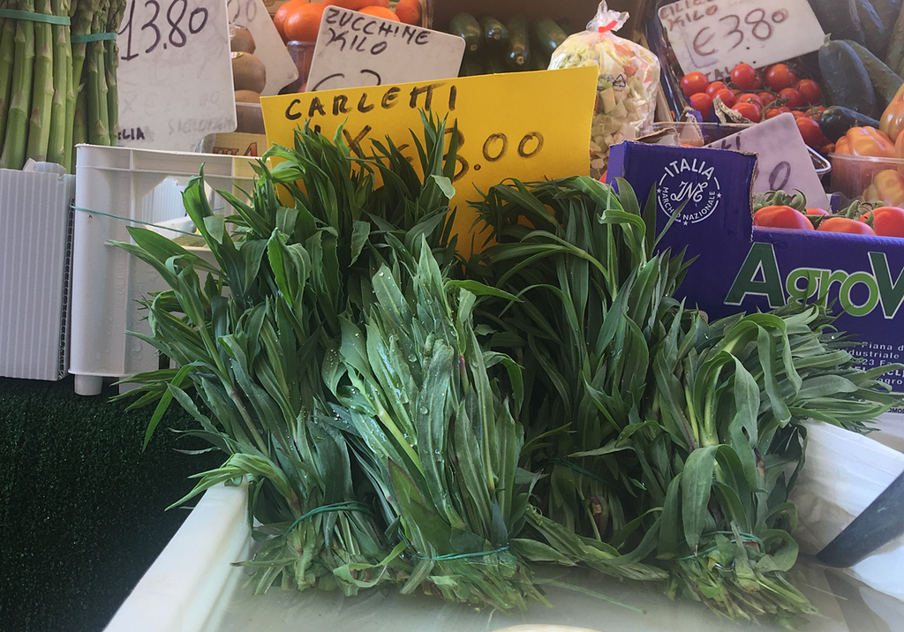
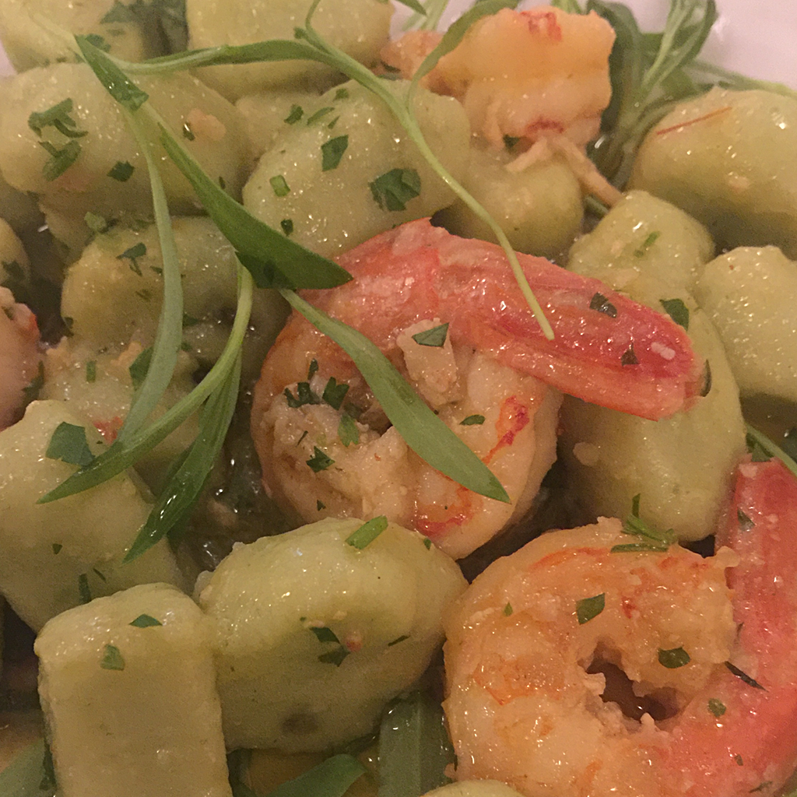

 {.center} 

We had a quick trip to Venice a few weeks ago, which included a good mix of the old and the new. A new restaurant was the [Antica Osteria Ruga Rialto](http://www.osteriarugarialto.com), a favourite haunt of a new friend. Having eaten cuttlefish twice already, I decided to try something new, green gnocchi with shrimps.

===

They came garnished with a light scattering of long, thin, bright green leaves. My first thought was tarragon, which I've been looking for in Rome forever. The flavour, however, wasn't that distinct. Delicious, leafy, grassy, and nothing I could place.

I devoured the dish, which was absolutely delicious, and asked the waiter what the herb had been. He didn't know, but came back from the kitchen with a reply. *Carletto.*

Disappointingly, there's nothing obvious on the first few pages of my search, but _Erba carletto_ turns up the entry for [_Silene vulgaris_ in the Italian wikipedia](https://it.wikipedia.org/wiki/Silene_vulgaris): bladder campion. I'd always known in the back of my mind that campion was edible, but had never come across it before, nor indeed tried it myself. I wasn't absolutely convinced and then, the very next day, there it was on sale.

{.center} 

I didn't check whether it had also flavoured and coloured the gnocchi. Possibly. They were light and delicious and not at all gluey. 

{.center} 

Italian wikipedia is full of details about the dozens of common names and ways in which it is used. English wikipedia not so much. There is masses of it around in the park at the moment, below the equally abundant elderflowers. I feel a foraging expedition coming on.

And to everybody who moans that you can't eat well in Venice, I say, "You're not doing it right".