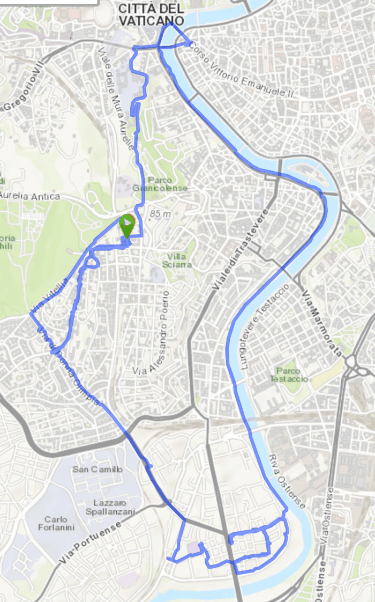

Took the Brompton out for a little spin yesterday, telling myself it would let me check more places for a black spray paint for cars, needed to get on with the Raleigh restoration. On the way I got some rust converter and snagged a couple of slices of pizza at one of the best local places, unchanged in decades.

{.center}

In the end, even though I didn’t actually find any paint, the bike was helpful because I could indeed pop into lots of shops and follow leads. According to one informant, there’s a place on via Gherardi (my old stomping ground) that stocks car paint, but it wouldn’t open till four, so will have to wait for another time.

The great virtue of the Brompton is that I don’t have to cycle back up the hill to get home. All I have to do is cycle to a suitable bus stop on the flatlands. So, of course, I cycled along the river to a far away bus stop and it was very, very pleasant, at one point much like being out in the countryside.

Joy.

Today’s task is to find someone with a bench vise so I can attempt to remove the Raleigh’s freewheel, which, if I succeed, will be even more joyous.
