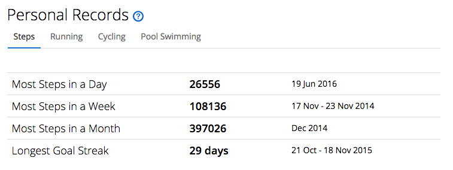

---
title: 'A new activity tracker'
published: true
date: '06-08-2020 15:30'
taxonomy:
    category:
        - blog
    tag:
        - General
summary:
    enabled: '1'
subhead: 'Precise, but inaccurate'
header_image: '0'
--- 

On a whim — a well-researched whim — I recently bought a new activity tracker, a [Xiaomi Mi-band 5](https://www.mi.com/global/mi-smart-band-5). It was intended to replace my Garmin Vivofit, which has served me more or less faithfully for six years. The original impetus for seeking a replacement was that I fancied keeping more of an eye on my heart rate, but only because since the lockdown I have actually been exercising more frequently and more intensely than before, and while that is its own reward, it would be nice to see some additional evidence that I am getting fitter.

===

The Xiaomi is a lot less expensive than the cheapest Garmin replacement, cheap enough that I can consider this an experiment, brought forward by the recent unpleasantness at Garmin. What is has shown, so far, is just how “sensitive” trackers can be.

I’ve been wearing both on my wrist for a couple of days now, just for fun. And right now, the Garmin shows me having taken 3680 steps while the Xiaomi says the number is 3697. Not a huge difference, I admit, and of course until I had two activity trackers, I was not in the least bit concerned about the accuracy of either one. Now I am.

Yesterday I did a experiment, twice, of counting 100 steps.

| 100 counted steps			|	Xiaomi		| Garmin			|
|:-			|:-			|:-			|
|	Trial 1		|	116		|	107		|
|	Trial 2		|	105		|		99	|

What surprised me was that, so far, neither one is consistently better than the other. Which just goes to show something or other. They differ on sleep tracking too, and though the Xiaomi is supposed to record naps, it failed to do so yesterday. There’s probably an option I have not yet found.

The new tracker is certainly a lot more capable than the old; six years is a long time in consumer electronics. It does measure heart-rate. Or rather, it shows me a number, which may or may not be accurate. I have nothing to check that with easily. 

I don’t really like the Mi Fit app, I have to say. Perhaps it is just unfamiliarity, but things seem to be hidden under out of the way menu options, and there’s altogether too much decoration and not enough information. But it does sync automatically, rather than me having to do anything, so that’s nice.

Of course, the question remains of how much use Xiaomi is making of my data; I just don’t know and I don’t even know how to find out whether it is phoning home with all my secrets. 

Then there’s the additional question of owning my data. As this is only my second ever activity tracker, I haven’t so far come across the need to extract my past data, but that’s something I ought to look into. I grabbed a screenshot of my previous personal bests. It’ll have to do, and I should make an effort to set some new ones.

 

Maybe tomorrow I will remove the Garmin and stop worrying about accuracy and truth. But first I’ll do a couple more counted trials.
