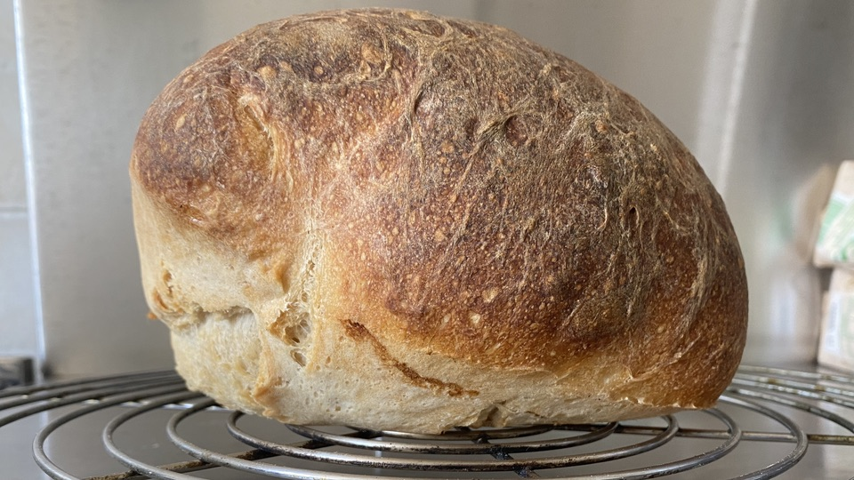
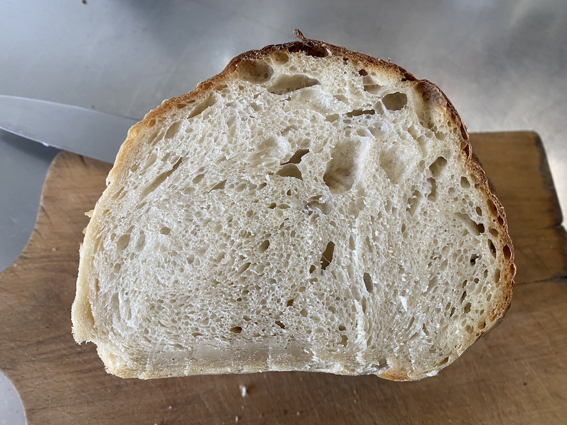

A couple of weeks ago, I read a fascinating post on The Fresh Loaf, in which [Kendalman](https://www.thefreshloaf.com/user/67600/track) described his interesting approach to stretch and fold and offered [an alternative explanation of what is going on](https://www.thefreshloaf.com/node/70339/stretch-and-fold-magic), because he believes the conventional view is mistaken. As near as I can tell, he says that there are two glues at work in the dough, a short-acting glue that preserves the shape of the loaf for about 30 minutes, and a longer lasting glue that maintains the whole mass as a whole mass. Stretch and fold activates the short-term glue, holding the loaf together while the bubbles caused by fermentation grow larger. It is the bubbles, ultimately, that give the dough its shape and hold it up.

> Nearly round bubbles packed together keep the shape of their gluten foam better than any other bubble shape and the bigger the bubbles the better because that spreads the dough weight over a bigger surface area and so makes it easier to hold up. 

Anyway, Kendalman helpfully linked to [a video of his procedure](https://www.youtube.com/watch?v=_WmV4xIJVMc), which he calls a kendalroll, that I watched absent-mindedly. The video certainly demonstrated that he got a lovely, well-risen loaf with no kneading and a lot of rolling. Proof of concept, as they say.

[{.center}](kendalrolled-loaf.jpg)

A couple of days later I discovered that we were almost out of bread, with a few days still to go before the big weekly bake, so why not give it a go.

I made a standard white sourdough at 75% hydration, mixed only enough to incorporate everything, and then proceeded to roll the log about every 30 minutes. I was a bit concerned that it might take a lot longer than Kendalman's yeast-powered dough, so I used double my normal amount of starter; pre-fermented flour was thus 40% of total flour.

Rolling the dough is a bit of a messy business, hence the lack of photographs, but it is obvious rolling is building strength and structure in the dough. In the and, after four hours, it seemed big enough to bake. Getting it onto the stone was tricky without being able to simply invert a banneton onto a peel, but I managed.

Halfway through the bake, when I opened the oven to remove the steam pan, I was very pleasantly surprised by how little it had spread. The end result was a really good loaf, with a fine crisp crust and a good, light and even crumb. Judging by the minor blow-out at the bottom of the loaf, I could even have left it to rise a little longer. The gummy bit at the bottom of the crumb photograph maybe confirms this. Very passable.

My kitchen doesn't really have room for doing more than one loaf this way (whereas bannetons stack nicely), so I cannot see adopting the kendalroll for everything, but for occasions when I want a good white loaf, especially for sandwiches, it is a winner.

[{.center}](kendalrolled-loaf-crumb.jpg)

Final conclusion: I think I have a better understanding of stretch and fold, and I have a new arrow in my shaping quiver, which is a win all round.

Syndicated to <a href="https://www.fornacalia.com/2022/a-new-way-to-shape-a-loaf/" class="u-syndication">Fornacalia</a>.
