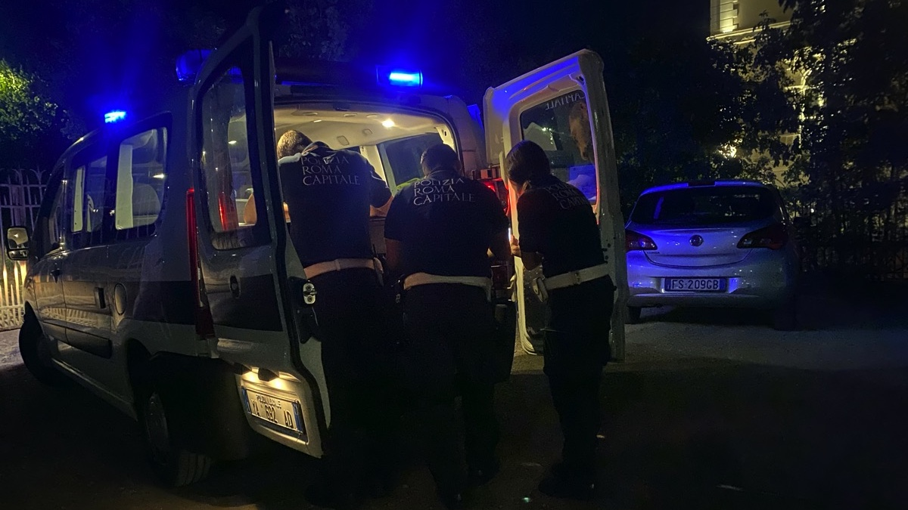
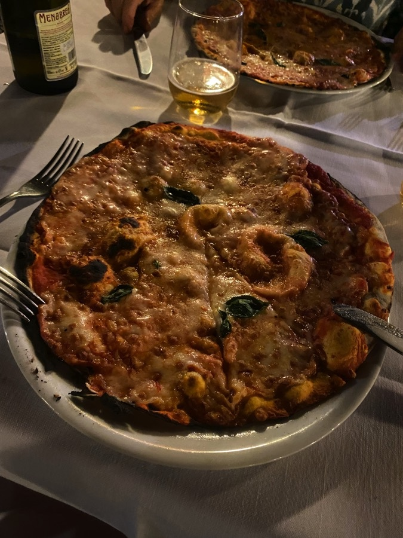

The Squeeze’s yoga class had transferred for the summer to a spot on the far side of our local park. Last night was the first chance she had to go and I elected to go with so that I could help on the way home. There was a beautiful fullish moon so it wasn’t hard to see and it was a very pleasant walk. When we got to the gate out of the park, however, disaster.

===

It was locked tight.

Buggeration. I could have sworn the park didn’t close until 9:00 pm. Nothing for it but to call emergency services (113, should you need it) and tell them the story. Someone from the local police called back about 8 minutes later to get more details of where we were and said it would be around 15 minutes before we could be released. Nothing for it but to sit and wait, there being no possibility of getting out anywhere else.

Around half an hour later flashing blue lights, three police officers, and a key. Freedom! But there was a catch. Unfortunately, they explained, they had to issue us with a penalty notice because we shouldn’t have been there after closing time, which moves from 9pm in August to 8pm in September. Ka-ching. €300. The cops really were very apologetic.

Waiting around while they filled in the forms, it occurred that since there was no sign of anyone sweeping the park, which is huge, before locking up, the real crime is that we wanted to get out. Presumably if you wanted to spend the night there all you would need to do is wait until opening time. As far as I am aware, though, there are no obvious encampments, so there must be some other sort of control to deter overnighters. Maybe a micro-adventure awaits.

Pizza and beer made for a suitable celebration.
