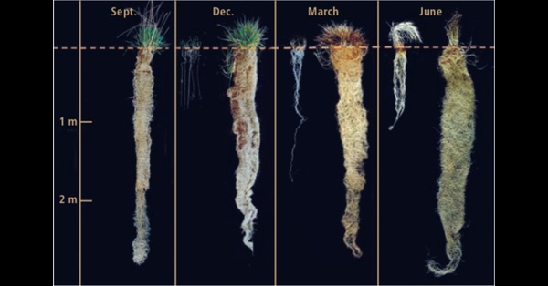

{.center}

Wheat is an annual plant; it dies after setting seed. Each year, the farmer has to prepare the land, sow seed, fertilise and protect the plants. When the ground is bare, between crops, wind and water can erode the soil. The shallow root systems of annual plants fail to exploit the resources of the soil and do little to improve it. So although wheat feeds us, it does so at considerable cost to the environment. It isn’t sustainable.

What if wheat were perennial?

<a href="https://www.eatthispodcast.com/our-daily-bread-30/" rel=canonical>Listen to A Perennial Dream at Eat This Podcast.</a>
