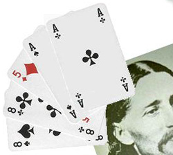

I've seen some schlock in my time but never, ever have I sat through anything like the never-ending stream of western clichés that is [Buffalo Girls](http://www.imdb.com/title/tt0111903/?fr=c2l0ZT1kZnx0dD0xfGZiPXV8cG49MHxrdz0xfHE9YnVmZmFsbyBnaXJsc3xmdD0xfG14PTIwfGxtPTUwMHxjbz0xfGh0bWw9MXxubT0x;fc=1;ft=22) with as much pleasure. There isn't a single stock scene or character missing, from the whore with (several) hearts of gold to the duplicitous schemin' redman to the faithful retainer to the wild mountain men to the toffee-nosed English fop to the mud-filled streets to the wide open spaces to the London fog to the dog whose looks say a thousand words to the flowing locks of Cody, Custer and Hickok   ... 

{.left}  Come to think of it, there is one missing cliché: when Hickock falls to the ground dead, I'd have laid odds there'd be a close-up of his cards. I'd have lost.  

Total, unalloyed joy. And Angelica Huston is a perfect Calamity.
