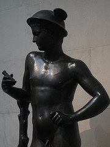

{.right} Tell me Mercury isn’t checking his cellphone to see whether anyone has sent him an SMS? One of the great things about Washington DC is just how much free art is available. (I think I’ve blogged about this before, but I’m blowed if I can find the post.) Anyway, that means one can pop in and out of galleries, see as much or as little as one wants and move on. So yesterday, after a quick zip through the Hirschhorn and the Sackler, where the faithful were lined up to see an exhibit that strikes at the very foundations of their faith, we ended up at the National Gallery of Art, where there was an awful lot to see. Photographs of New York. Rembrandt drawings and prints. A roomful of fine Goyas, just in passing. And the wonderful exhibit of diptychs from the Netherlands. All rather fine, but also a bit much to take in for one session, so by the end of the visit my head was beginning to spin just a bit.

{.right} No wonder then, if you ask me, that when we saw this 16th Century Milanese Mercury, we thought of young men and their mobile phones. Of course the connection has been made before, but this got me thinking about [Philistinism](https://en.wikipedia.org/wiki/Philistinism). Wikipedia says the derogative use of the term dates back to German students in the late 17th century, “as a dismissive term for the townspeople”. Why Philistines rather than, say, Moabites or Ammonites, is not even touched upon. Was it simply because the Philistines were enemies of the Jews, and the German students saw themselves as the chosen people? It can't be that simple.
