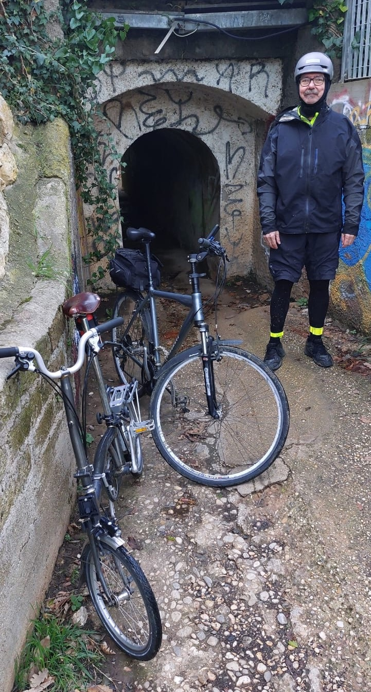

On Monday, perhaps foolishly, I went for a bicycle ride despite a very iffy weather forecast. A friend from the [Venice ride in May](https://www.jeremycherfas.net/blog/brompton-world-championships-2024) was in town and wanted to go for a ride together, and two previous dates had fallen through. Monday was our last chance on this trip, so we went for it. 

===

The first problem was that we were in the last carriage of the train and the station where we were due to get off had a short platform. From our carriage we had nowhere to go. Without bikes we could have scrambled to one of the forward carriages to get off. With bikes, we were stranded. Particularly galling, nobody had said anything about it in advance, or we might have been able to struggle forward with the bikes.

Still, the next station wasn't too far away and I knew the area well enough that it would be relatively easy to join up with the route as planned in Komoot. Of course, we hadn't reckoned with it starting to rain as we got off the train, but it did. I plotted our way to the planned route and off we went, but it was grim, not only because of the rain but also because there was no way to avoid a main road and the cars paid no attention to the rain. No close shaves, but still unpleasant.

Eventually we made it to the route proper and that was much better. Very quiet roads, a long stretch on a reasonable path through the woods and while there were a few climbs the way undulated generally downhill. The rain stopped, we dried out a bit, all was well with the world.  At one point we were high up out in the open and the sea appeared, shimmering in the distance.

{.center}

Also, a stack of ominous clouds. We hoped to be able to outrun them. It was not to be.

The rain started again in earnest towards the end of the ride, where the planned route would have taken us onto a very busy stretch of road. I could see an opening in the crash barriers on the other side, and knew the area well enough to decide to cross over and reroute on quieter roads. So, across we went, and as I was looking at the map a woman told us to go on and that we could get under the railway line a little further ahead. She was right, but walking the bike through a very constricted tunnel was a bit of a palaver.

{.center}

Still, we made it, and the rest of the ride, despite the rain, was not too tricky. We got to the station with plenty of time to wolf down some excellent pizza by the slice and a fabulous supplì. All's well etc.

The one downer in all this was to discover yesterday that Komoot, despite claiming to be adjusting the route and what not, is not recording the actual route taken, only the planned route. I asked about this, and got a long-winded reply that offered a complicated workaround that involved replanning the tour, downloading a GPX file, and uploading the file as a completed tour. I might even do that, eventually, to avoid the heavily trafficked road. Of course, belt-and-braces me also recorded the route with Compass; it might be easier to convert that to GPX and upload directly.

Anyway, here's the route, with the deviation in detail on the right, in case anyone wants to try this before I update it on Komoot (click to embiggen).

[{.center}](maps-2024-12-09.jpeg)
