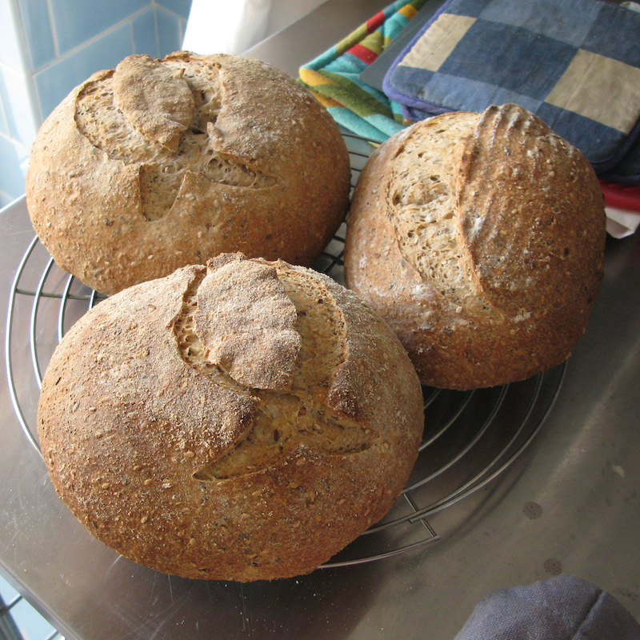
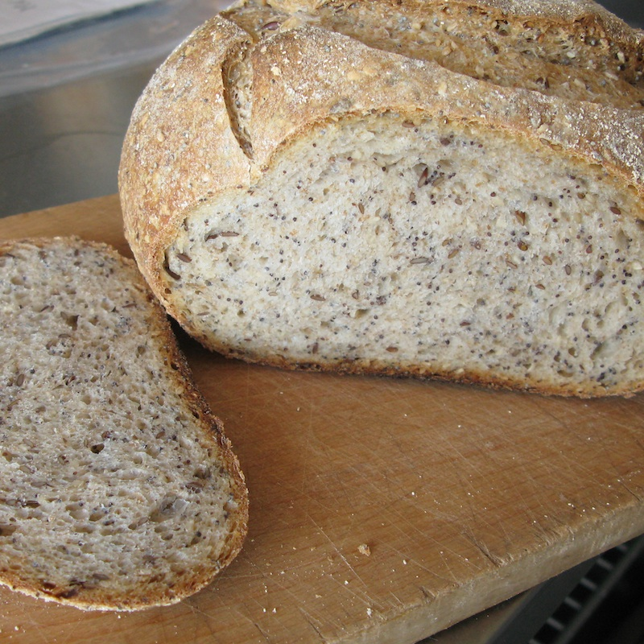

I had a bunch of good, ripe 100% starter left over from a batch of [oatmeal sesame bread](https://www.fornacalia.com/2009/sesame-oatmeal-bread/) that I made last weekend. I wanted a seedy bread, but I finished the last of the sunflower seeds a couple of breads ago, and haven't got enough items on the mail-order shopping list to get some more yet. So I thought I'd just invent something. Some wholemeal, but not too much. Some seeds; flax, poppy and sesame. How hard can that be?

Not at all.

I worked backwards from a finished dough weight of about 2.2 kg (for two loaves at 800gm and one at 600gm) and 65% hydration, using the 354gm of 100% white starter on hand and adding the seeds dry rather than from a soaker simply because flax seed in a soaker is a recipe for mucilage up the wazoo.[^1] Here are my quantities:

[^1]: *2020-06-20:* Why did I think that was a bad thing, back then?

## Ingredients

````    
354gm ripe 100% hydration white starter
611gm water (788gm for 65%, minus the 177gm in the starter)
303gm wholemeal flour (25% of the total flour weight)
732gm Manitoba flour (75% of the total flour weight minus the 177gm in the starter)
20gm salt (10%; I prefer less salt in seedier breads)
75gm flax seeds
75gm sesame seeds
50gm poppy seeds (so seeds are about 10% overall)

So total flour is 1212gm, total water 788gm, seeds 200gm.
````

## Method

Mix the water into the starter first, then add the salt, seeds and flours. Stir roughly with a wooden spoon to get everything more or less mixed in, then tip out on the counter and get everything well mixed in and incorporated using your preferred method. I've developed a kind of press and fold technique, scooping up the dry stuff with a scraper and dumping it on top of the pressed out dough before folding. A couple of those, and everything coheres well enough to give it a quick knead, and then turn it into the cleaned, lightly oiled bowl.

Bulk ferment for 90 minutes, with a stretch and fold every 30 minutes. Shape and allow to rise before baking with steam in a hot oven (230℃ 450℉). After 20 minutes, remove the steam source, turn the heat down to 210℃ (410℉) and bake a further 22 mins, or until done.

{.center}

Allow to cool fully before slicing.

{.center}

I'm sharing this via [Yeastspotting](http://www.wildyeastblog.com/category/yeastspotting/) not because I think it is such a brilliant recipe (although it is delicious) but to encourage people to experiment. Once you've baked a few different kinds of bread, and got the hang of a few different techniques, it is actually quite easy to extemporise within the rules. And of course, if you make it up, who can say whether it is right or wrong?
