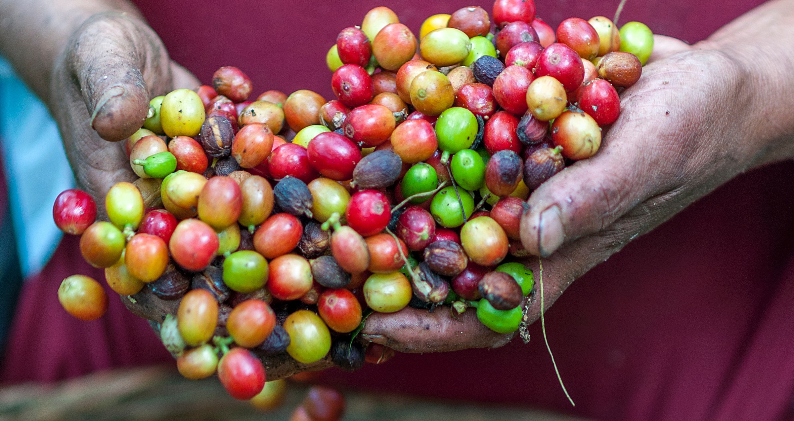

{.center} 

Quite by coincidence, I listened to two podcasts about coffee back to back. Well, it wasn't truly a coincidence; I saw that there were two in my queue and so I interfered with the ordering to listen to them one after the other. Anyway, Benjamen Walker's [*Wake up and smell the coffee*](https://theoryofeverythingpodcast.com/2019/12/wake-up-and-smell-the-coffee/) was the kind of podcast I wish I could do more often.[^2] Benjamen took his growing love for coffee on a global tour of discovery that took in Paris, Copenhagen and Nairobi. I don't know whether he planned it that way, or simply took advantage of various opportunities (there was something in the credits about having received a grant to do it, so maybe it was planned as a whole.) The result was an entertaining, complex episode that exposed parts of the coffee chain that even coffee fans might not know about.

[^2]: I have, in fact, made a similar episode: [Pushing good coffee](https://www.eatthispodcast.com/pushing-good-coffee/).

Perhaps the most telling point was made by one of the founders of Coffee Collective, in Denmark, who explained that because in the past most coffee had been produced by enslaved labour, the cost of coffee barely reflected the cost of production. That cheapness created a culture that happily tips down the drain coffee that has sat neglected too long. You wouldn't do that with a glass or two of wine left in a bottle (although you might feed it to your vinegar mother). The historically low price of coffee is probably what also causes right-thinking people to blanch at the thought of a $15 shot.

Slave-grown coffee also came up towards the end of Lord Bragg's sleepwalk through an episode of [*In Our Time* on coffee](https://www.bbc.co.uk/programmes/m000c4x1). In fact, it may even have come up only during the podcast listeners' special treat of bonus material from Melvin and his guests. It wasn't the only interesting thing to arise late and, in my view, much too briefly. There was also the foundations of Italian coffee culture, which mandated a top price for a coffee but only if it came without service. Standing at the bar and gulping a tiny espresso was thus cheaper than paying a lot more to linger at a table. In Italy, and in France too, the sale of coffee went to the guilds that also sold distilled spirits, which explains a lot.[^1] The stove-top Moka coffee maker, launched in the 1930s and still a classic icon of Italian coffee at home, became popular partly because it made a reasonable facsimile of an espresso at home, and also because it was it was futuristic, modern, and made of aluminium.

Then there are the huge differences between Italian coffee culture and the "Italian" coffee bars in London in the 50s and 60s, where patrons did linger and where the coffee was mostly milk, as it remains in so many places today. Class and coffee is a ripe area for discussion. Starbucks, apparently, was popular in blue states 20 years before it began to make inroads in red states. In that context, and the cappuccino-sipping Guardian reader,  another guest raised the milkiness of caffé latte and its kin as infantilising, people walking down the street and "sucking on their sippy cups".

Coffee producers don't drink coffee, just as cacao farmers don't eat chocolate. Preparation is too much of a fuss, for one thing, and for another some countries outright banned coffee roasting; beans had to go for export. (Benjamen Walker's interview with the first coffee roasters in Kenya was eye-opening.) Now farmers are leaving the land, in part because they cannot earn enough growing coffee, and moving to the city, where they encounter, and drink, instant coffee. Coffee remains a mostly urban drink, and as urbanisation increases in the developing world, so does coffee consumption. 

[^1]:  *Caffé corretto* remains one of my favourite examples of Italian hypochondria and pragmatism. I did not, however, know that the fascists had outlawed espresso machines because coffee was luxurious and an import.

What I'm saying, I guess, is that the guests on *In Our Time* seemed to have much more interesting information to offer than the same old stories of frisky goats, the growth of Lloyds List and invention of *The Tatler* and *The Spectator*. Perhaps I know too much, but I do think I have learned a lesson listening to those two podcasts together.

What that is, I'm not yet ready to say.

!!! Also at [Eat This Podcast](https://www.eatthispodcast.com/a-tale-of-two-coffee-stories/)  

!!! Photo by [Rodrigo Flores on Unsplash](https://unsplash.com/photos/T5qjs-63kqQ)
