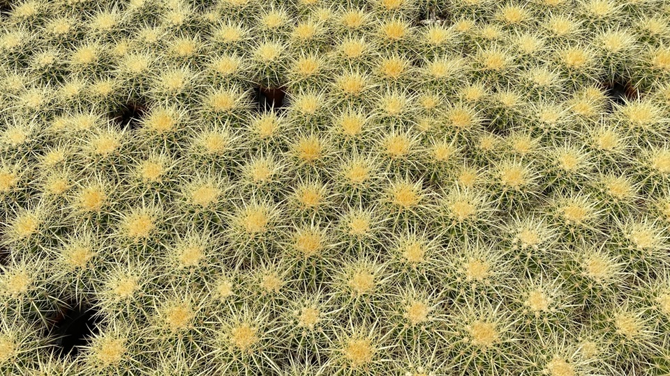

I’ve been enjoying The Human Flower Project [^1] for a couple of weeks now with its eclectic mix of news from the intersection of flowers and culture. When I was a very early visitor, however, Julie posted a thought on “[geraniums](https://web.archive.org/web/20061029185328/http://humanflowerproject.com/index.php/weblog/comments/i_say_geranium/)” that prompted me to get on my hobby horse and ride off in all direcctions. The essence of it being, common names are all very well, but if you and I want to agree that we are talking about the same thing, we need to agree to use that thing’s proper name.

[^1]: 2021-07-31: Alas, missing presumed dead since July 2019, and its [Twitter account](https://twitter.com/humanflower) went silent at the same time.

That set me musing about the whole names issue. I’d willingly Taser the next person who tells me that a tomato isn’t a vegetable, it’s a fruit. Yeah, yeah, smartypants. It’s actually a vegetable and a fruit. Just like an aubergine (or eggplant, if you prefer) or a pumpkin. Because the two words are from completely different realms of discourse, the botanist’s and the cook’s. In fact, I’m not sure whether a botanist would recognize the word vegetable, as such.

It's a fruit if you tend to cook something sweetish with it, or eat it as a sweet thing (which some tomatoes are). It’s a vegetable if you tend to make something savoury with it, or eat it as a savoury thing. And of course the boundaries are much more fuzzy than that, but you all know what I mean.

And, yes, I’m aware that my take on this does make red onions a fruit when trendmeisters turn them into [jam](http://www.google.com/search?client=safari&rls=en&q=red+onion+jam&ie=UTF-8&oe=UTF-8). Especially if you eat the jam on bread, rather than accompanying a nice pork chop.

There are lots of other examples that bug me. Like the people who think it is a Hold the Front Page Fact that the banana tree is not a tree but a herb. Realms of discourse again. Sure they can go to the Wikipedia and find a botanical [definition](http://en.wikipedia.org/wiki/Herb) that bears them out; no woody stem, dies back etc. But when you are sitting under the shade of one, resting your back against the trunk (or pseudostem, if you must) enjoying a quiet rum and water, it is a tree alright. The average person, I submit, couldn’t give a fig for the botanist’s view of what constitutes a herb. Herbs are plants used for flavouring or medicinally, or both. End of story.

(Parenthetically, I’d give you a genuine Hold the Front Page banana factoid if only I could remember it properly, and Google is being no help. The annual global harvest of bananas, if laid from end to end, would encircle the globe three times at the equator, to a depth of a metre or so. I’ll try and get this straight and update it here when I do.) [^2]

[^2]: 2021-07-31: I never did bother, and I do not intend to now.

The whole business of silly discussions of this nature galls me. Dr Johnson is said to have remarked, when he and Boswell observed two fishwives (or similar) haranguing one another from their facing windows on opposite sides of the street, “They will never agree, for they are arguing from different premises”.

{.center}

Having said which, I did come across a rather nice example on [BPOTD](https://botanyphoto.botanicalgarden.ubc.ca/) [^3] (which had led me to the Human Flower Project in the first place. (An English teacher of long ago smiles in his grave as I deftly steer this rambling around in a circle.) Of _[Rosa pulverenta](https://botanyphoto.botanicalgarden.ubc.ca/2005/07/rosa-pulverulenta/)_, Daniel slyly wrote “I admire it for its prickles ([not thorns!](https://en.wikipedia.org/wiki/Thorns,_spines,_and_prickles)),” thus guaranteeing that everyone who read it would rush off to the definition and, in his usual way, be educated a little despite themselves.

[^3]: 2021-07-31: Still going strong, though no news since April 2020.

Nicely illustrating my point about realms of discourse, the Wikipedia article deftly explains why rose thorns are prickles, not thorns, and then captions a nearby photograph "thorns on rose stem".[^4]

Summing all of which up (Lawks!) the picture shows the “thorns” on cacti at one of my favourite nurseries.

[^4]: 2021-07-31: And, being Wikipedia, it has long since been disambiguated and corrected, in spades.
