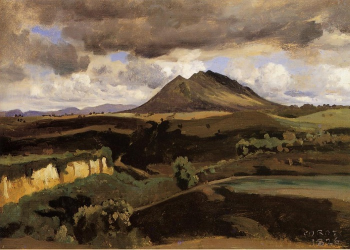

As you drive on the A1 out of Rome (and especially when returning to the city, there is a hugely impressive mountain to the west of the motorway. It rises up, floating on the plain and dominating the landscape. This is Mount Soratte, which [Wikipedia](https://en.wikipedia.org/wiki/Monte_Soratte) tells me is an isolated limestone ridge, about 5.5 km long and boasting six separate peaks. It has been a draw for artists ever since Camille Corot changed landscape painting with his dazzling portraits of the mountain.

===

{.center}

We had an appointment to meet friends for lunch nearby, but driving for an hour, eating for three and then driving home holds little appeal, so we decided to visit Sant’Oreste, the village perched on one of the peaks. The plan was to maybe walk in the national park to the highest peak, but the village was so interesting we never managed that. Another time. 

Something prompted me to take the good camera; I’m glad I did.

<figure>

<figcaption style="font-style: italic;">I for one am glad there was a car park</figcaption>
</figure>
 
 It is hard to convey how sheer the slopes are in some places.
 
<figure>

<figcaption style="font-style: italic;">Steep, or what?</figcaption>
</figure>
 
Many churches, this the most impressive.
<figure>

<figcaption style="font-style: italic;">San Lorenzo Martire</figcaption>
</figure>

Wherever you look, views, views and more views.

<figure>

</figure>

<figure>

</figure>

<figure>

<figcaption style="font-style: italic;">Note to self: return in summer?</figcaption>
</figure>

Huge variety in the details of the houses, which would repay closer study, but lunch was calling.

<figure>

</figure>

<figure>

</figure>

Next time, the park, because we spotted a fine restaurant which looks like it deserves a good walk first.
