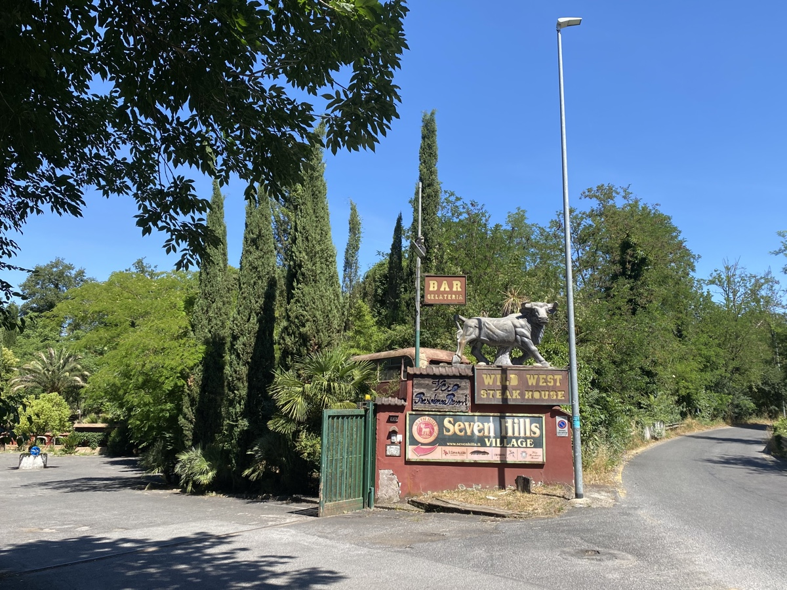
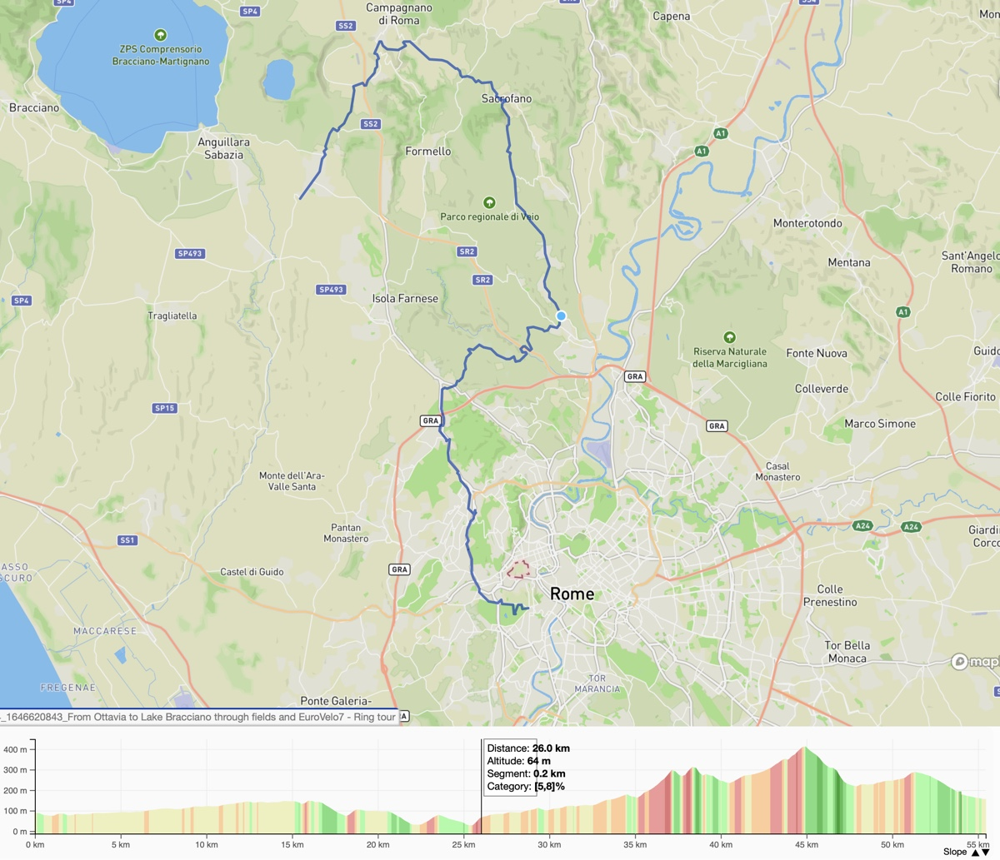
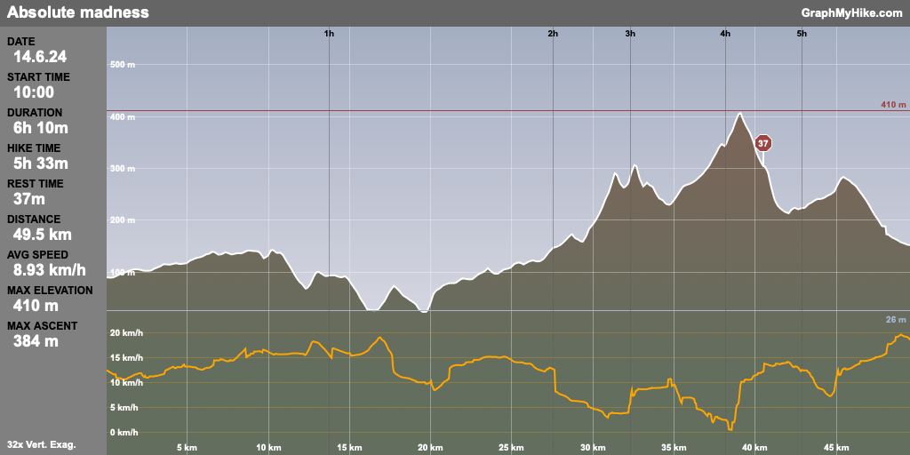

⏱️ 05:04&nbsp;&nbsp;&nbsp;⇄55.4km&nbsp;&nbsp;&nbsp;⌀10.9km/h&nbsp;&nbsp;&nbsp;↗774m&nbsp;&nbsp;&nbsp;↘707m

It is strange indeed, on a bicycle ride, to view successive downhill sections with mounting trepidation, but that's what happened to me on Friday. After the first glorious descent, swooping around beautiful curves for just about two kilometres, and maybe the next too, longer and gentler, I realised that I had bitten off far more than I could chew.

Absolute madness.

----

Call it the blindness of age and denial. I saw that the route was marked *Expert bike ride*. No problem, I consider myself sufficiently expert, not as a downhill racer, but on roads and tracks, sure, I can handle most things. I totally failed to notice both *Very good fitness required* and the total ascent of *970 metres*. What was I thinking? Or not thinking. Cycle to the lake at Anguillara (where I used to live) and which we often visit in the car and take the train back. Sure, why not.

It started well enough, with a pretty gentle ride to join the Komoot planned route and then leaving Rome on an excellent cycleway. Too soon, though, I joined a road that took me through the suburbs beside the railway line that goes out to Anguillara and beyond. Relatively easy going, that was, and the traffic wasn't too bad. Then I crossed over the main road to the lake and immensely enjoyed the road called the Giustiniana. Smooth surface, very little traffic, big swanky villas on both sides and fields full of vegetables and big straw bales. Then came that glorious first descent, at the bottom of which was an extremely strange attraction that I just had to photograph.

{.center}

The next few ascents and descents were mostly fine, but I could feel myself becoming exhausted and as I entered the Parco Regionale di Veio, about 26 km in, I began to realise that I had been very foolish in choosing this route. The next 20 km went relentlessly up, and I had to walk many of the steeper climbs.[^1] At one point I sat down at the side of the road, took a proper look at the chosen route, and realised how much was still ahead of me. A nice bloke in a car stopped and asked if I was OK. I was, mostly, and although I had entertained thoughts of locking the bike up somewhere and coming back in the car to collect it, I was sufficiently crazy at this point to say No, I'm fine, just tired.

[^1]: I'm a little peeved that my watch thought I was cycling, very slowly, and didn't record any steps.

Which was true. The planned route as seen on the phone has a tiny little elevation profile that told me I was very close to the highest point, just under the peak of Monte Razzano at 431 m. So on I trudged. And, eventually got there. At that point I sat down again to catch my breath before tackling the equally steep descent, and I'm glad I did because it required a lot of concentration. Shortly after turning onto a busier road there was a bar, the first actually on the route. Not only that, but they had sfogliatelle straight out of the oven, offered to keep an eye on the bike, and led to me a shady terrace where I drank a litre of water and slowly devoured the pastry.

<figure>

<figcaption style="font-style: italic;">Entrance to La Panuozzeria, the bar that saved my life. </figcaption>
</figure>

<figure>

<figcaption style="font-style: italic;">It doesn’t look like much from down here, but that’s the summit of Monte Razzano.</figcaption>
</figure>

I rested for about 40 minutes, furious with myself for having been so foolish, proud that I had actually made it, and resolved to be sensible and cut the ride short. Yes, Anguillara was only 11 km away, but Cesano di Roma, through which the train from Anguillara would pass, was only about 5 km, and the ups and downs were mostly gentle.

With minutes to spare I got to the station, bought tickets for myself (€1.00) and the bicycle (€3.50), got on board, propped up the bike and fell into a seat. And despite the craziness of the day, I managed to cycle the kilometre or so up to home.

What did I learn? That I am an old geezer who is not nearly as young or as fit as he thinks he is. That I rush into some things without doing the needful. And that I am also bloody stubborn sometimes.

## Visualise this!

{.center}

As ever, I'm keen to see what I accomplished, so I used gpxstudio to join the tracks that Komoot recorded. But I realised that I was wrong about the elevation profile, which on my last [slightly less foolish bicycle ride](https://www.jeremycherfas.net/blog/heroic-bicycle-ride) I thought might be displaying "a quasi-heatmap" of my speed. Nope, the colours denote slope, not speed (though, of course, those are closely related). So this time I plugged the track into [GraphMyHike.com](http://www.graphmyhike.com/). That did a fine job of displaying both the elevation profile and the speed, a 20-minute moving average, ignoring rests longer than 5 minutes.[^2] 

[^2]: Amazingly, there was only one of those; all the others must have been shorter, though they didn't feel it.

{.center}

The tricky part about these graphs is that distance, rather than time, is constant along the abscissa. That seemed a bit strange at first, but it makes as much sense as keeping time constant. The decline in speed after 2 hours and then again after about 3:30 is salutary, slower than walking without a bicycle, for sure, because of all those little rests.

## Final thought

There's a perfectly good, more or less level road that skirts Monte Razzano. Climbing to the summit only to zip back down on the other side strikes me as the sort of thing only a madman with something to prove would do. QED.

