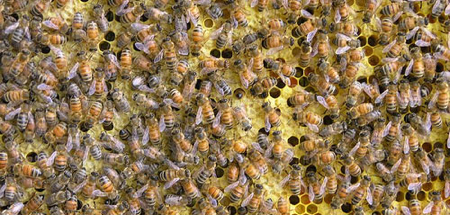

{.center}

Jaron Lanier has a new essay at [Edge](https://www.edge.org/), John Brockman’s Third Culture Wordfest. Lanier asks whether the kind of collective wisdom exhibited by phenomena such as Wikipedia is actually [not so wise](https://www.edge.org/conversation/jaron_lanier-digital-maoism-the-hazards-of-the-new-online-collectivism) after all. He is by no means the first to do so, but he manages to raise a whole thicket of interesting questions and to provide some useful tools to cut through the tangle. to whit:

> The hive mind should be thought of as a tool. Empowering the collective does not empower individuals — just the reverse is true. There can be useful feedback loops set up between individuals and the hive mind, but the hive mind is too chaotic to be fed back into itself.

The build-up to this, which is in the way of a conclusion, rang particularly true, given some of my recent experiences at work, about which I will say nothing.

I cannot possibly do justice to Lanier’s essay by paraphrasing or even cherry-picking, nor do I want to. But it does prompt a kind of infinite regress of the absurdities and value of the hive mind. I found it on the list of popular items at [del.icio.us](https://pinboard.in/popular).[^1] So an aggregator, one with no human ability, alerted me to the existence of something that I enjoyed reading and gained a lot from, something that bemoans the existence of non-human aggregators and the way they divorce “popularity” from “importance” and “personal voice”. You may find that as odd as I do.

Then there’s the fact that the essay is at a site I like, but that I find not quite compelling enough to go to regularly in an old-fashioned pull for information. I’d much rather it pushed its stuff to me through RSS. I can (and have) subscribed to the email alerts, but I could find no sign of a feed on the amazingly cluttered home page, and I obviously missed Lanier’s piece first time around. I find far more diamonds sifting feeds through a newsreader than any other method, del.icio.us included. Perhaps I’m wrong, perhaps there are good reasons, but I’d have thought that someone as resolutely bleeding edge as Brockman might have implemented a feed.

flickr photo by [Mandie CBM](https://flickr.com/photos/captivated/). 

[^1]: 2022-06-03: Superceded by Pinboard, so I updated the link.

