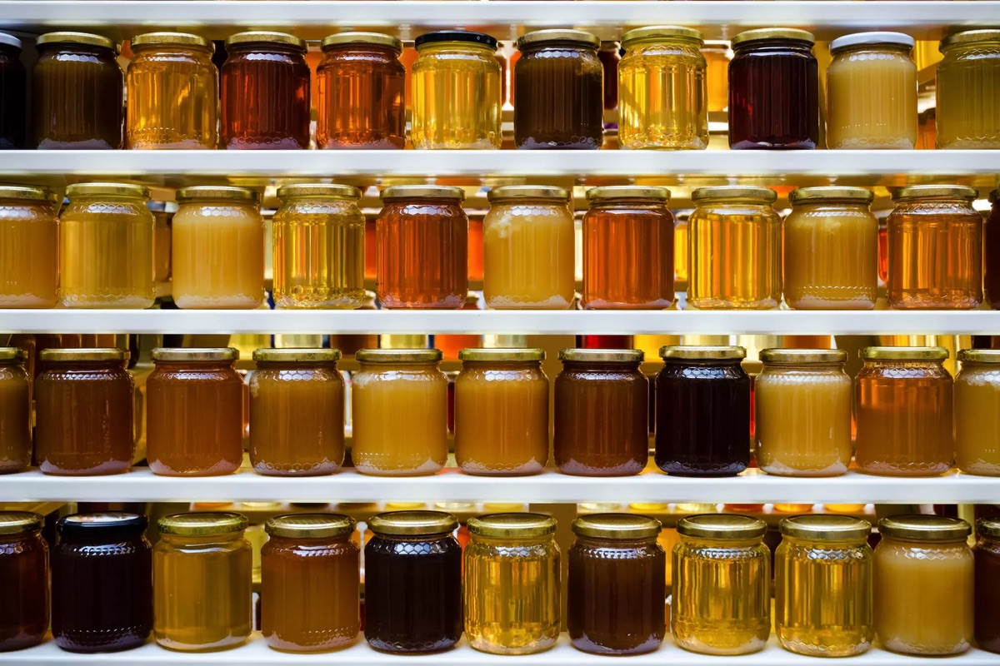

{.center}

The available figures on honey adulteration are pretty alarming: 46% of samples in the EU, 100% of honey exported from the UK, more than a quarter of Australian samples “of questionable authenticity”. However, as Matt Phillpott pointed out in [a recent episode of Eat This Podcast](https://www.eatthispodcast.com/honey/), one of the great difficulties honey poses is that it is so variable. All of the many “natural” components of honey vary from batch to batch, hive to hive, season to season, so that while a specific “unnatural” chemical might unambiguously signal adulteration, other kinds of evidence are a lot less cut and dried.

===

That kind of uncertainty spurred the Government Chemist, the UK’s official food inspector, to look at the evidence behind a claim in the Daily Mail that “Supermarket brands of honey are ‘bulked out with cheap sugar syrups made from rice and corn’”. Behind that headline, with its exculpatory quotation marks, the Mail back-pedalled slightly[^1] and allowed the supermarkets to cast doubt on both the results and the robustness of the tests, carried out by a German laboratory.

[^1]: “If the analysis, using a new generation of ‘nuclear magnetic resonance’ tests, is proven, it would represent the UK’s biggest food fraud since the horsemeat scandal in 2013.”

## What to do

The Mail’s article was based on a report from the German company, which did not contain all the data from the tests, but rather an opinion on what those tests showed. To some extent, that’s what the supermarkets were arguing against, saying that their own tests were more reliable, or more trustworthy, or something. To try and settle the matter the Government Chemist posed two questions:

> 1) Is it acceptable to report an adverse interpretation without exhibiting all the supporting data? (2) How may a valid overarching authenticity opinion be derived from a large partially conflicting dataset?

Two papers in the journal Science of Food offer answers.[^2]

[^2]: [Honey authenticity: the opacity of analytical reports - part 1 defining the problem](https://www.nature.com/articles/s41538-022-00126-6) and [Honey authenticity: the opacity of analytical reports—part 2, forensic evaluative reporting as a potential solution](https://www.nature.com/articles/s41538-022-00127-5), both open access.

## Opacity

In the first, the researchers looked at the details in three sample Certificates of Analysis (CoA) from the German laboratory, focussing on the specific measurements, and they pick up several inconsistencies. This is not the place to go into detail — there’s plenty in the papers — just to note that the laboratory described some samples as “compliant” even though the measurements were not different to those from samples described as “non-compliant”. These differences point to the larger problem of identifying adulterated honey: honey’s natural variability, made worse by disagreement between different analytical techniques.

The paper cites, for example, a small study in which Danish beekeepers sent 14 samples (definitely not adulterated) to two different companies, including the German laboratory. Both companies said that 4 of the 14 were adulterated. The beekeepers say that is impossible (allowing for the possibility of emergency feeding sugar solution ending up in the honey). The companies disagreed on another four samples; one found evidence of possible fraud, the other did not. The beekeepers asked for a different analytical test to be carried out on seven of the eight samples flagged as possibly adulterated; all seven were found to be “not adulterated and without feed residues”.

The Government Chemist’s paper concludes that “The summary opinion of the reporting laboratory … was unequivocally that the samples were noncompliant. However our critical examination of the CoA data reveals a much more nuanced picture from which it is currently difficult to draw a definitive opinion on the authenticity of the samples examined.” 

Laboratories should make their detailed analyses available, rather than their summary judgements.

## Forensics

The second paper offers a potential way forward, by looking at the balance of probabilities and presenting conclusions suitable for a legal decision. That seems sensible given that, at least in the UK, food law is a matter for criminal justice. This approach, known as evaluative reporting, follows three basic steps.

First is a question for the analytical laboratory: is the test sample typical or atypical compared to a reference set of typical samples? One value is unlikely to be enough, and even a typical value does not let the sample off the hook as it may be that the adulterant is too dilute to be detected, or may not be detectable at all with the chosen technique. Likewise, a single atypical value does not condemn the sample, but should trigger extra tests, as in the Danish beekeepers’ study.

Second is to put some sort of number on the likelihood that an atypical result is indeed the result of adulteration rather than chance. This is the likelihood ratio, a statistical measure that compares the probability of the result being true under the two conditions, actual adulteration *vs* an “accident” not the result of adulteration. If the two probabilities are roughly the same, then clearly there is not much support for the charge that adulteration is to blame. If the probability of the accidental hypothesis is much lower than the probability of the adulteration hypothesis, support for the “truth” of adulteration is stronger. 

A key point is that one can convert the likelihood ratio into a verbal form, from “moderate support” where the probability of the accidental hypothesis is up to 100 times less than the adulteration hypothesis to “extremely strong support” where the accidental hypothesis is more than 10,000 times less likely than the adulteration hypothesis.

Stage three then would be a decision, based on the all the evidence, to do something about the sample.

## Yes, but ...

That’s all well and good, and the paper offers a couple of worked examples to show why, for instance, a summary that the German laboratory based on its measurement of the enzyme diastase was flawed. Using a likelihood ratio requires having a good estimate of the probabilities of certain markers being present in genuinely unadulterated samples. Caramel, for example, may be added by adulterers to mimic the dark colour of forest honey. It could also, perhaps, be present in unadulterated samples, though it is hard to imagine how. In any case, to be able to offer strong or very strong support for the proposition that caramel signals adulteration, it would have to be undetected in at least 1000 samples of pure honey.

The battle against fraudulent honey will thus need, in addition to new analytical techniques to detect new cunning adulteration, the development of agreed databases representing typical measurements for a wide range of honeys. To that end, a month ago the Government Chemist published a [Protocol for the Collection of Honey Reference Samples](https://www.gov.uk/government/news/protocol-for-the-collection-of-honey-reference-samples), a global first. The hope is that the protocol “will help in standardising how authenticity databases are built and curated and will lead to more trust in them”. 

That’s unlikely to stop adulteration, which remains far too profitable, or satisfy supermarkets, who all want to proclaim their own monitoring as superior. However it might, eventually, with the recommendations of how to interpret and present the data, bring some adulterators to a form of justice.

! Syndicated to <a href="https://www.eatthispodcast.com/adulterated-honey-not-pure-and-not-simple-either/" class="u-syndication">Eat This Podcast</a>.