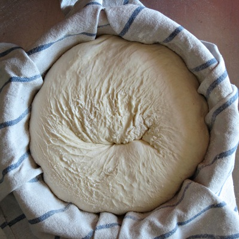
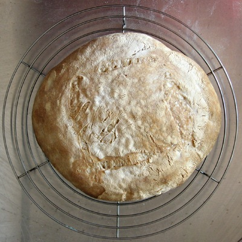
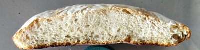

---
title: 'Aesthetic disaster, taste triumph'
published: true
date: '22-08-2009 07:41'
taxonomy:
    category:
        - blog
    tag:
        - Bread and Cheese
summary:
    enabled: '1'
subhead: " "
header_image: '0'
--- 

I thought I had solved my bread problem, and had high hopes for my most recent batch, [^1] but it was not to be. The dough was just incredibly sticky. Not slack, sticky. It clung tenaciously to hands, bowl, scraper, worktop; I really felt completely unable to manipulate it. I did, gingerly and with extra flour, manage to form a sphere of sorts and to plop that, upside down, into a little basket I bought at the local plant nursery. Lined with a clean towel and liberally dusted with flour.

===

{.center} 

I left the formed loaf in its basket out on the counter (at 30℃) for about an hour, maybe more. It rose quite a bit in that time. Then I put it into the fridge overnight at 4℃. In the morning it was still risen, so once the oven had heated up I carefully inverted the basket over a baking tray and was horrified to watch it spread out like something that had just plopped from a cow's bottom.

Hurriedly I slashed it, vaguely thinking that perhaps it had all this hidden potential to spring, and bunged it in the oven with a steaming pan of water below. I didn't even grant myself time to photograph the plop.

It barely moved during the baking. Spring? Hah! Overdeveloped for sure.

{.center} 

Much disappointed I stuffed it in the freezer for a rainy day, and dove back into the internet to investigate further. The good people at [The Fresh Loaf](http://www.thefreshloaf.com/) suggested other options, which I am doing even as I type. The starter now has feasted on strong flour, and rather than 20% I used only 10%. I allowed 30 minutes to hydrolyze and then folded in the bowl. I've been doing that every half hour for three hours, almost, and it is now time to shape. I shall retard the loaves overnight, and bake them directly from cold in the morning.

The flat loaf, however, had its moment in the sunset sooner than expected. I had been planning to go out for a bite with some friends. In the event, so many places are closed that I offered to cook. Out of the freezer came the loaf, into the oven for 10 minutes just before we ate just to crisp up the crust a bit, and it went down a treat.

{.center} 

Handsome is as handsome does, as I once read in a book on training lurchers.

[^1]: Based on 500 gm total flour, at 60% hydration, using 20% starter. 
