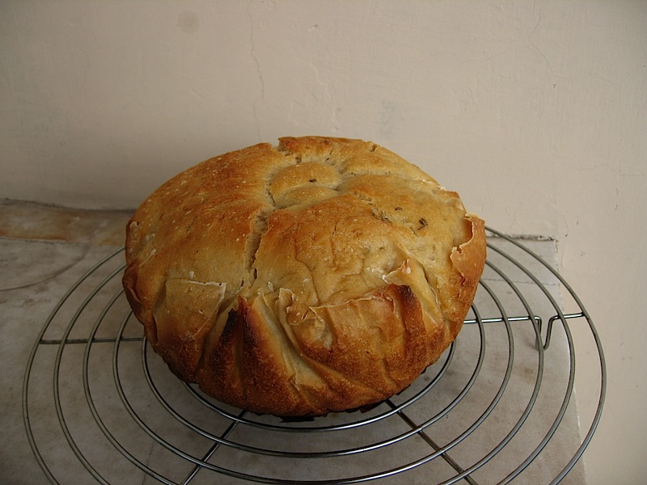
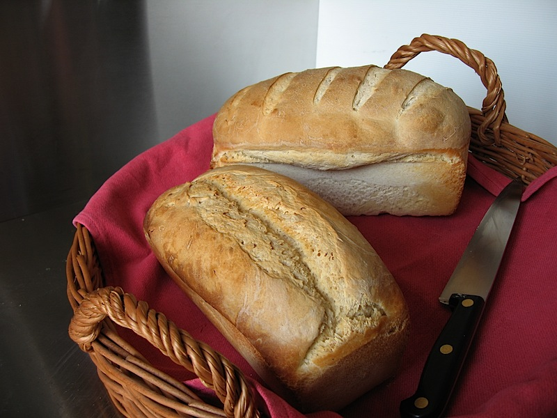
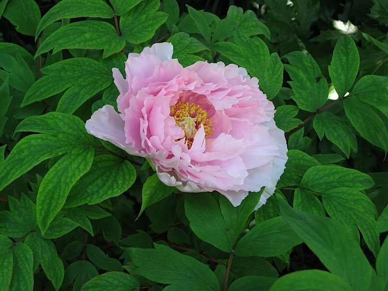

I know there are readers who don’t care that what they see here is now being served by a delicious new all-singing, all-dancing, super-spiffy server -- but they might give silent thanks when they (or so I am promised) receive far fewer error messages in the future.  For them, then, which is probably everyone except me, a very quick update.

The bread-baking has been going really rather well. I’ve now got the sourdough producing reliably; good crisp crust, chewy crumb, with enough big holes to give variety. The dough is essentially hydrated to only 50% (with the starter probably a little more, but not much). The long first and second fermentations though make it much slacker than a yeast dough of the same proportions. I think now I might try and aim at 55% for a few loaves.

{.center}

Sometimes I do it in a closed, pre-heated casserole, even though letting it rise in a bowl lined with baking parchment gives a very strange-looking crust; there's no other way to handle it. And the curious indent in the middle of the loaf above is the result of the loaf rising so well that it stuck to the plate on top of the bowl.

{.center}

The method scales well too, and 100 gm of starter is quite capable of lifting (and even over-lifting, if you look at the loaf in the back) 1200 gm of flour. We took one of these to a lunch date, and while our hosts were happy to receive it (I think), they immediately announced what a shame it was that they had already sliced their loaf. Thank heavens we had a back-up at home. But is that correct breadiquette? I have my doubts.

And finally, as they used to say on the News at 10:

{.center}

I wish I could say this was on my terrace, but it isn’t. Spring, however, is very definitely here.
