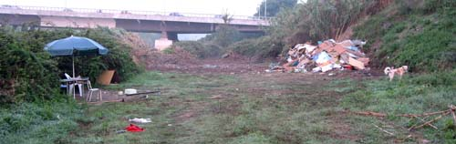
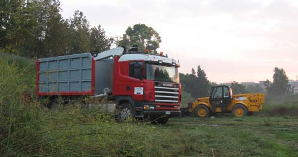
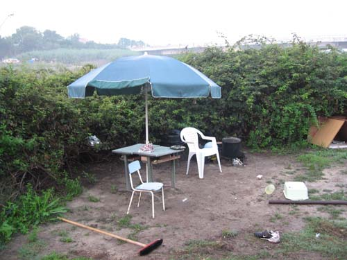
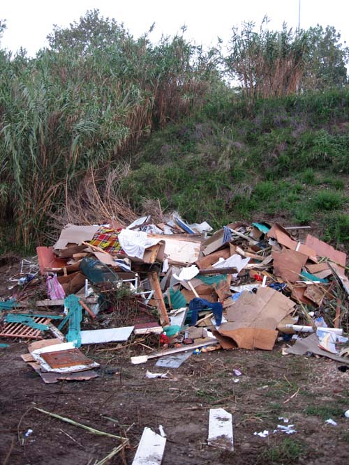
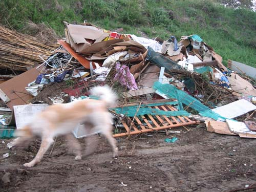

{.center}

On Monday they started to clean up the rough ground down by the river. Not just cutting back the vegetation. Demolishing the rude huts and shacks erected by the “gypsies” who called the area home.

{.center}

Bulldozers, big trucks with grab cranes. Smashed dwellings carted away like the junk they were made of. Early this morning, my first visit down there with the dog since it all began, my feelings were very mixed, to say the least.

{.center}

Lord only knows where they scavenged their stuff. I used to see them, morning and evening, struggling up and down with clapped out shopping trolleys to carry the rewards of their dumpster diving. Much, I presume, got sold at Porta Portese market every week. Maybe some went for scrap. But some stayed on site to add to creature comforts. They modified the landscape too. Under the bridge, where the ground drops steeply to the most hidden of the houses, someone had thoughtfully cut steps into the slope. But they never bothered to dig a latrine.

Lord only knows also where the people have gone. No-one seems to care. The general feeling among the dog walkers is that the clean up is a good thing. Also a resignation that they -- or their replacements -- will be back soon enough. That as soon as the city has done its job, moved on to some other eyesore and forgotten about this particular space, the space will once again become a home to the homeless. And that's what I find hard.

{.center}

I've experienced precisely one nasty moment down there in almost two years, mild threats from a belligerent drunk. But I've also avoided used needles, human shit, broken glass and all the rest of it. I'd feel a lot more kindly disposed to the dispossessed if they would only show some concern about their surroundings, which are also my surroundings. On the other hand, if they know that they are going to be booted out, just not when, why bother? On the third hand, if they took more care, maybe they'd be less likely to be booted out. No simple answers.

it is also true that if the city -- or someone empowered by the city -- simply cut the vegetation regularly, say once a month, it would within a year become a really nice spot, which, I would hope, people would not want to destroy. I don't know whether the city has any such plans. Apparently they cleaned up a piazza elsewhere and gave a bar permission to set up there if they kept it clean, and the bar and piazza have flourished ever since. But that may be an urban myth.

{.center}

Whatever happens, we both far prefer walking down there now, and that has to be a good thing.
