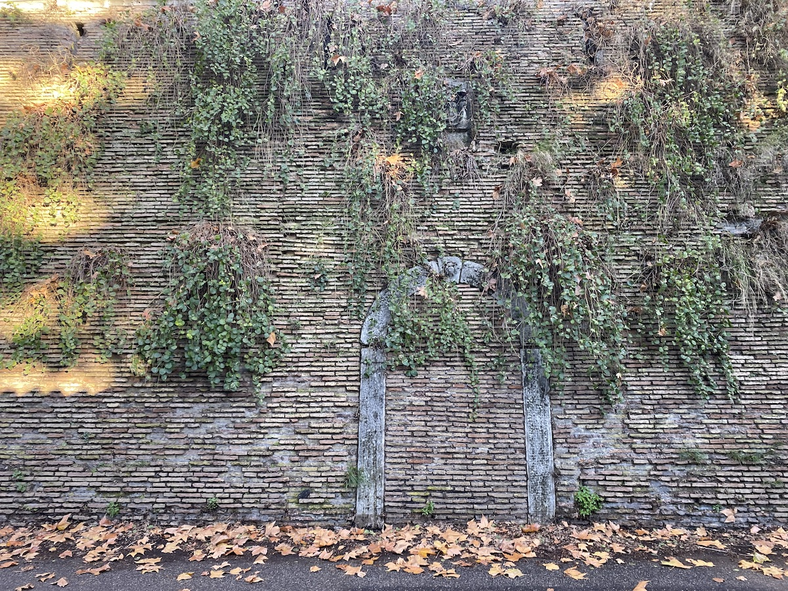
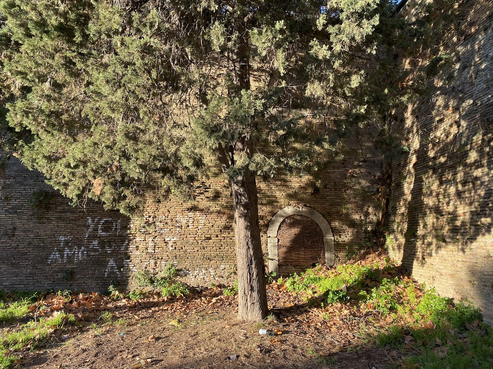
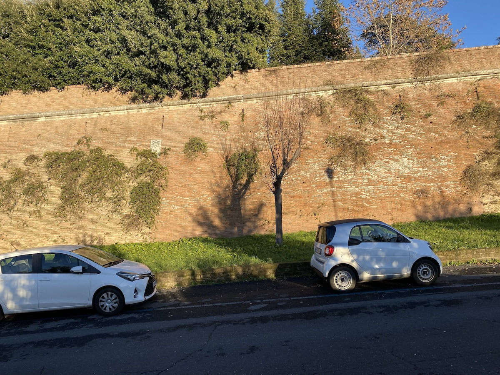

I love the idea of having an algorithm decide where I should go on an outing. The problem with [geohashing](https://geohashing.site/) is that “my” graticule is quite large and almost three-quarters water. Neighbouring graticules are often too far away. So despite my best intentions, I have not actually been on very many expeditions. That is why I was very interested when [Christof](https://secretbearsociety.org/@christof) said he was considering building an alternative version that would work on what I think one might call decigraticules and centigraticules or, more simply, what Christof calls walkable and bikeable. The result is a [brilliant website](https://rabbit-rabbit.quest) that offers you much more accessible options every day.

Today, I put it to use for the first time.

===

I knew I would not be able to reach the designated point, because the local area is littered with gorgeous ecclesiastical establishments that are closed to outsiders, and [today’s point](https://rabbit-rabbit.quest/#mode=walkable&map=41.89628/12.45827/16.5) was inside one of those. But it was close enough to a road I know well to be worth trying. So off I went, and good fun it was too.

One of the strange things about walking along the big walls of Rome is that there are all sorts of openings, not exactly secret, but not open either. What is behind them, I can only imagine; and those imaginings are not worth dwelling on. I expect they’re more likely to contain ancient equipment crumbling slowly to dust than meeting places for secret cabals of power brokers. I didn’t linger to decipher the graffiti either; maybe something about you are my love ...

{.center}

{.center}

 Here’s the proof that I got as close as I could. Well, technically I could have crossed the road and stood hard up against the wall that you see in the photo below, but I think it is possible to take this kind of thing too far.

{.center} 

I can quite see using rabbit-quests reasonably often to decide where I should go on my daily walk or bicycle ride. (Today’s bikeable point wasn’t far, but it involved some unavoidable roads I know to be tricky.) And I really like the idea that my destination is determined by Mauna Loa’s carbon dioxide readings. Today’s: 421.43 ppm.