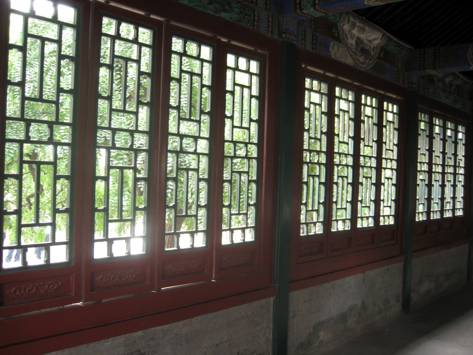

{.center}

I tried a long and meaningful post about getting straight from flickr to here. But I was being too clever, and the words vanished into the aether. So I'm trying again, with a bunch of garbage words, just to see what's what.

I tried a long and meaningful post about getting straight from flickr to here. But I was being too clever, and the words vanished into the aether. So I'm trying again, with a bunch of garbage words, just to see what's what.

I tried a long and meaningful post about getting straight from flickr to here. But I was being too clever, and the words vanished into the aether. So I'm trying again, with a bunch of garbage words, just to see what's what.

What I tell you three times is true.
