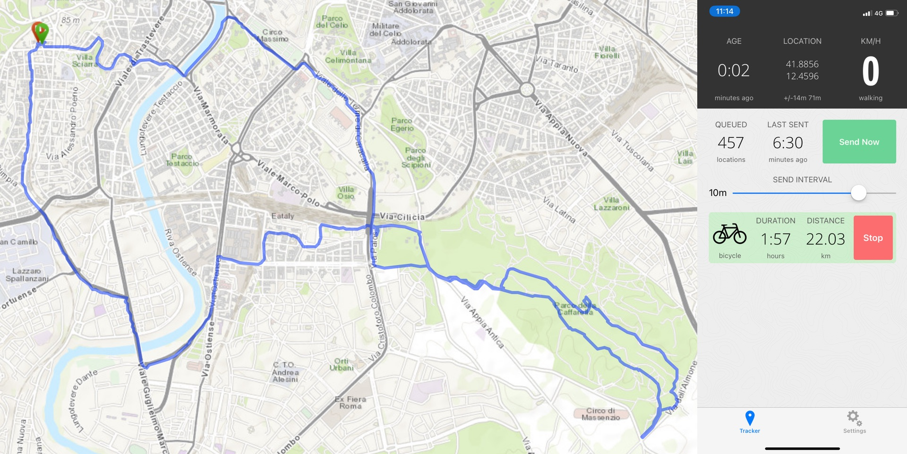
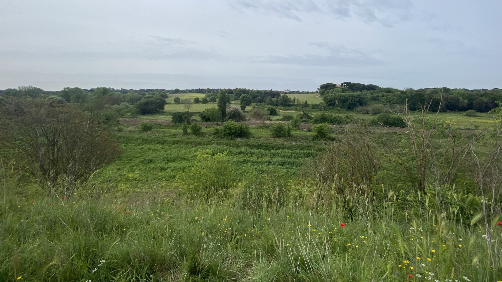

Took myself off for a bicycle ride this morning before a forecast 24 hours of rain set in. Destination was the Parco della Caffarella, which before I had been to only with organised rides and somebody else doing the navigating. Getting to the park is straightforward, but I wish I had been paying more attention during those earlier rides (or maybe checked on the tracks for those days) because I did get myself a bit lost and that led to some hairy sections.

===

{.center}

My general practice is to leave the trip running from start to finish while I pause the phone activity monitoring when I, er, pause. As a result, average speed is slightly less on the trip than it actually was when moving. No biggie.

The trouble came when I decided to cross over the little stream that runs through the park. The north side of the stream is a lot more rugged than the south, the paths are not nearly as broad and there are some very steep and rutted sections. On one of those I came a cropper, plunging into a gully, front forks bounced down and the wheel did not climb out of the gully, resulting in me coming to a sudden halt and toppling over sideways. No harm done, to me or the bike, but a spill all the same.

{.center}

Once I got back onto the other side of the stream it was all more or less plain sailing to get home, apart from a little detour down an ill-advised path that seemed to end with a couple of rusty cars in front of chained gates of corrugated iron. I turned around sharpish when it became clear I could go no further. Rome is full of places like that, hidden away in the greenery and hiding who knows what.
 
