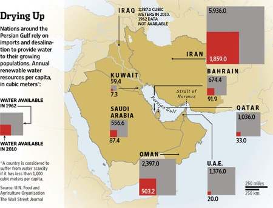

Just before that bit about "Nor any drop to drink," The Ancient Mariner tells us how the ship's timbers are drying out. For my purposes, those boards could equally well be the boards looking after US farmers. Sure, many of them are facing the worst drought since 1956. But according to [NPR's Planet Money](http://www.npr.org/blogs/money/2012/08/14/158787593/episode-394-why-taxpayers-pay-for-farmers-insurance), not only is more than 80% of the potential loss covered by insurance, the US government pays more than half of the farmers' premiums and pays the insurance companies to offer crop insurance. What's not to like?

This really was an eye-opener of an episode, not least for rounding up the guy who used to lead the North Carolina Peanut Growers Association and who seemed happy to admit that elements of the Farm Bill were so complicated that only three people in the country could understand them, and his job was to keep it that way.

A day later, an article asks [Where Are All the "Food Libertarians"?](http://reason.com/archives/2012/08/18/where-are-all-the-food-libertarians), interviewing the author of a study who says that "the great majority of Americans support increasing the extent to which food is regulated". This is more complicated than it looks, because regulation covers both food safety and agricultural subsidies. Jayson Lusk, the researcher in question, has this to say about that support for regulation:

> One important factor that our survey did not address is whether public support for food and agricultural policies will remain high when people are made more aware of the specific costs of government action in this area. Many economists, including myself, have been critical of many of the policies this sample of consumers found so favorable, in part because it does not appear the benefits outweigh the costs. Only time will tell whether economic analysis on these matters will have any influence on the public’s ideologies with respect to food.

If only three people -- I exaggerate, obviously -- understand, say, crop insurance in the US, is it any wonder that the public seems to think it is a good idea? [^fn1]

In my view, the most important impact of the current US drought is that it might just help to persuade people there (and elsewhere) that Something is Up. In poor parts of the world, where crop insurance remains a pilot project, small individual efforts are underway [to prepare for climate change](http://blog.ecoagriculture.org/2012/08/17/awf_kenya/). [^3]

{.center} 

Even rich countries can by no means buy their way to water (and food) security, as [Thomas Barnett](http://thomaspmbarnett.com/globlogization/2012/8/17/chart-of-the-day-water-and-food-in-mideast.html) explains with reference to an article in the [Wall Street Journal](http://online.wsj.com/article/SB10001424052702303684004577508051266269904.html).[^2]

[World Water Week](http://www.worldwaterweek.org/) starts next Sunday; I wonder whether these bigger stories will get a look in. Or will it be crops per drop and all that jazz.

[^fn1]: Look at the comments to the Planet Money blog post. 

[^2]: Behind a paywall, alas.

[^3]: _19 January 2018_: Pity they seem to have lost Neil Palmer's photo; I bet it is a corker. They usually are.