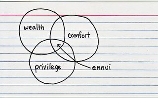

{.center}

Such a rush to get the [big giving post](http://jeremycherfas.net/blog/get-happy/) out the door yesterday I completely forgot to link it to Jessica Hagy's Index Card for Monday of this week.

That’s part of the “[defer](https://www.jeremycherfas.net/blog/50-x-100-x-50-revisited-ii#:~:text=Don't%20defer%20it%20again%2C%20do%20it)” problem too. I had starred it for coming back to later, and thus had managed to forget it more or less completely, until today’s [Indexed](https://thisisindexed.com/) jogged my memory. But I digress...

Of course I don’t believe there's a pattern to any of this. Synchronicity is just that; things happening at the same time. As is coincidence. On the other hand, as I’ve noted often, the human mind is the most marvellous pattern detector. And this week it has detected a pattern of sorts to do with how to do good.
