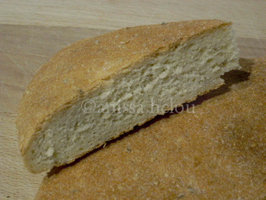

> It is the day before Christmas and I wouldn’t be cooking normally. If I am in Beirut, it is either my mother or sister at the stoves and if I am in England, I would be in the country with my English adoptive family.

Anissa’s [recipe for Moroccan bread](https://www.anissas.com/ksra-or-moroccan-bread/) is tempting, and interesting in that she adds some water after the first kneading. I’ve seen that suggested as a good idea for [high-hydration breads like ciabatta](http://www.wildyeastblog.com/2008/07/28/sourdough-ciabatta-rolls/), but by the look of her k’sra the dough doesn't seem to be all that wet. Of course, if she had used weights instead of volumes it would be easy to estimate ... and easy to replicate. Not sure I want to make the effort, even though I do have scads of excellent durum flour in the house.
