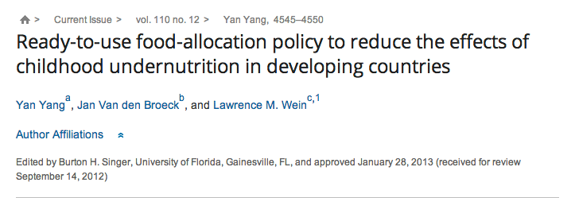

{.center} 

Were two hyphens ever more idiotically placed? For those who can't be bothered to read the [original](http://www.pnas.org/content/110/12/4545.abstract.html?etoc) [^fn1] let me enlighten you.

[^fn1]: Talk about a bait and switch. 

  1. The policy is not ready to use; and

  2. It is not about food allocation.

That is all.