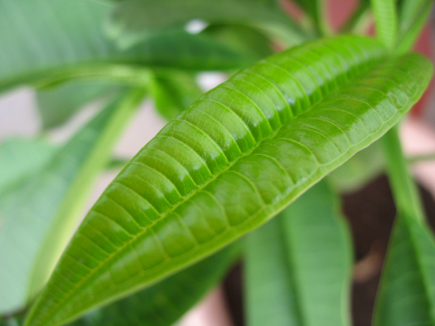

Actually been back a little while, frantically catching up and trying to cope with too much heat, too much humidity and not enough (or any) escape. Apart from work, where the a/c is about the best that can be said for the experience. So, as the previous post was all about the magic frangipani's near-death experience and resurrection, I'll make this a quick what's happening on the terrace post.

{.center}

===

Watering remains a huge problem in this weather, and I owe a huge debt of gratitude to Jeffrey and Martha, who stayed here and looked after the babies. Without them, death would have been certain for almost all. So, that's a single baby frangipani leaf above, and, for comparison, the whole resurrected thing below. Will it flower this year? Who knows. [^fn1]

[^fn1]: And when do the dog days start, officially? 

{.center}

Then there are the tomatoes, Pugliese Green from my own saved seeds. It is a well-known fact that fruit is perfectly ripe the day after birds have destroyed it. So as soon as I saw that the naughty crows had eaten the ripest, I brought the others in.

{.center}

They're wonderful; dense with flavour, and chewy without being tough. A great blend of sweetness and acidity that makes me wish I could grow them in more bulk to try a bit more selection. Which reminds me, I mustn't forget to save some more seeds later in the summer, and that means keeping the crows away.

{.center}

And finally, a sunflower, backlit by the setting sun. There's something really rather sad about sunflowers in a pot, all droopy mangled leaves on sparse stems, which is why I concentrated on the flower. The variety is called Black Velvet, a stupid name if ever there was one. I planted some seeds of Vanilla Ice too, but the pictures aren't as dramatic. They were my last seeds, and I've a feeling that both varieties are sterile, which is a shame.

{.center}

Anyway, that'll do for now. I'm also playing with the new Post Image capability to see how that works out. Might mean I have to find an image for everything, which would not be good. We shall see.[^2]

[^2]: 2021-07-24: Irrelevant, now.

