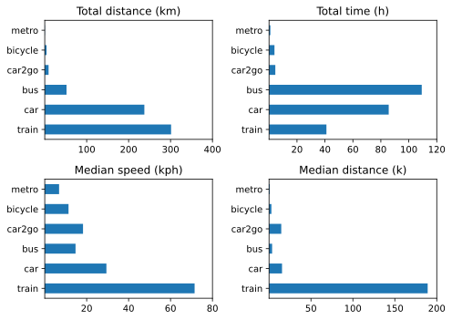
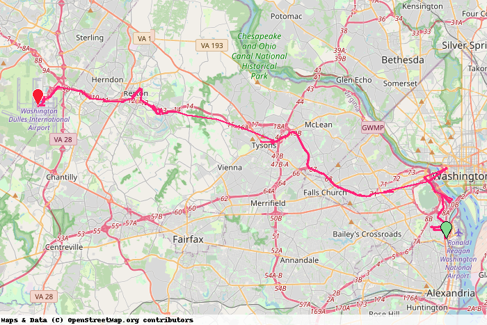
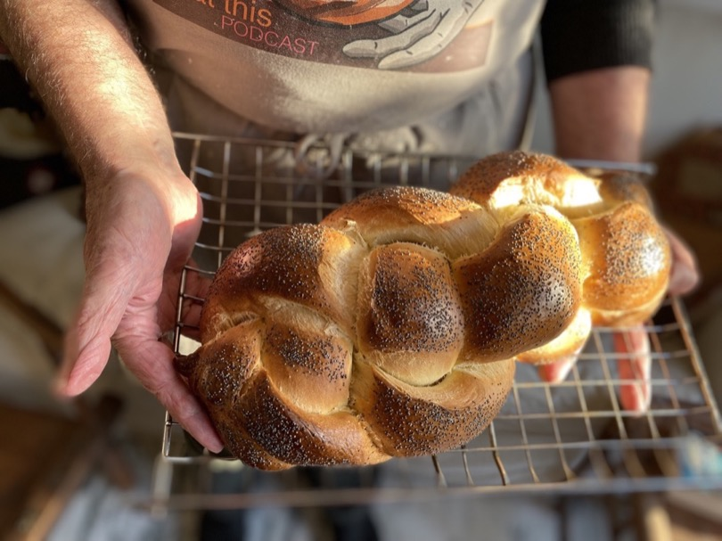

Many of the annual reviews from other people that I’ve read so far seem to agree that 2022 was not a great year. I’m not so sure. It wasn’t nearly as disrupted as 2021 and, aside from certain health-related restrictions, for me personally it was actually quite an enjoyable year. At least, looking back, I cannot recall anything absolutely horrible about it. That said, I remain aware of how privileged and fortunate I am; how could I not?

===

I derived great satisfaction from finishing my year-long effort to revisit old posts and bring them into the fold, hunting down broken links wherever I could and enjoying some of the meatier posts I wrote in the past. I didn’t manage to pull together anything resembling an index of various larger topics, so that is going onto the long-term to-do list. The realisation that I really do not need to work as hard as I have been for money also proved tremendously satisfying and pushed me to restart another `$project` that had long been stalled. That mental reset came late in the year, after I had been dunned for a pretty hefty tax bill, so is likely to be even more satisfying in the coming year.

One of the pleasures that has become much more apparent over the past year is revisiting the past, not only in old posts but also in journaling. Two years ago I re-upped Day One and have used it most days ever since. The pleasure lies not in the daily note I scribble, but in the On This Day feature, which allows events and feelings from long ago to bubble up again, some completely forgotten, others still sharp. It’s a fun end to most days, sharing these with The Squeeze, knowing that today’s note will amuse us again in years to come. Is this a sign of old age?

This being the second year of an annual review, I think I will more or less follow the precedent set by last year’s organisation.

- [By the Numbers](#numbers)
- [Media Consumption](#media)
	- [Books](#books)
	- [TV & Movies](#tv+movies)
- [Eat This Podcast](#etp)
- [Moving Forward](#moving)
- [Staff of Life Stuff](#bread)

## By the Numbers ##

All these were extracted the old-fashioned way, either by letting Apple Health tell me or by keeping a running count.

- Steps per day 9096 (10,040, 9144)
- Active Energy 767 kcal per day (823, 685)
- Resting Heart Rate 54 bpm (54, 53)
- BP systolic 119–135 (115-143, 120-147); diastolic 69–77 (63-83, 55–81)
- Weight 88.24 (86.45, 87.23)

Not a lot to say about the vitals, except “age”. Also, at the end of 2021 my doctor put me on a supplement called Armolipid Plus, to reduce those pesky bad cholesterols. It worked, so I’ve been taking one a day ever since, and this morning I had blood drawn for an annual check-up so may be able to update further in a day or two.

- Naps 148 (181)
- HIIT 90 (116)
- Read 209 (203)
- Podcasts 325 (440) logged.

Pleasantly surprised that I managed to read on a few more days in 2022 than 2021. Got to improve napping.

## Media Consumption

Still keeping [a log](https://jeremycherfas.net/blog/what-ive-watched.html) through the year, and once again I am astonished to have almost no recollection of some things even though I wrote them down. Here are some choices I do remember.

### Books

**The Lincoln Highway** by Amor Towles was the best novel, with **Our Man in Havana** by Graham Greene a close second. **Alan Furst** was a new discovery for me, with a series of vaguely linked stories of espionage between the wars in Europe. Utterly engrossing stories that seem incredibly well researched and beyond truth in a funny kind of way. I’ve read three so far (and watched one TV adaptation) and plan to continue, probably in order, because that’s just how I am. I ploughed my way through Frank Norris’ **The Octopus** too, sort of for “work”, and while it was strange going it was also very interesting and should result in a good podcast episode. **Sourdough** by Robin Sloan was an entertaining romp and fun to decode.

In non-fiction, the book of the year for me was **Oceans of Grain** by Scott Reynolds, and not only because it resulted in three outstanding episodes of Eat This Podcast. Such a wide-ranging and thought-provoking account of the history of wheat and how that interacted with, and in many cases shaped, world history. A total treat that makes me hope Scott produces something more detailed about the mysterious Parvus. Spin-offs from that included **The Last Grain Race** by Eric Newby, which, despite getting me utterly tangled in the rigging, was fascinating and brutal. I read a load of other non-fiction for the podcast, which for some reason (to be remedied?) I didn’t log.

### TV & Movies

The find of the year was a French cop procedural called **L’Engrenage**, or **Spiral**, which we watch from Australia with the help of a VPN. (Australian TV adverts, which we cannot avoid, are so bad.) **Ozark s04** was a disappointment. As I said at the time, “Crime pays if you’re rich and middle class, not if you’re very bright trailer trash”. Overall there was so much good TV: **Mare of Easttown**, strange, strange **Severance**, **Anatomy of a Scandal**, even the clichés in **Tehran s02** were super tense,  **Bad Sisters** was a joy, **Yellowstone** a modern fairytale that I’m not unhappy to abandon because fuck Paramount Plus. **Slow Horses s01** was probably the best series of the year, and makes me think I might turn to Mick Herron when I’m done with Alan Furst.

Movies, streamed and otherwise, seemed to be less than compelling this year. **The Tragedy of Macbeth** was wonderful and **The Good Liar** was gripping, though it did require quite a lot of exposition. **Belfast**, in an honest-to-god cinema, was exciting and very moving. Tom Hanks in a fat suit and a proboscis couldn’t spoil **Elvis**, and **Amsterdam**, also at the cinema, was stylish and not-so-subtly topical. I don’t log movies on flights, but they helped pass the time, which is all I ask.

## Eat This Podcast

Only 18 episodes of [the podcast](https://eatthispodcast.com) this year, one fewer than 2021, and 22 issues of [Eat This Newsletter](https://buttondown.email/jeremycherfas). Both are slightly down on 2021, mostly because of an extended break over the summer. While I don’t pay much attention to numbers of downloads and listens, I am a little concerned that the number of people who subscribe to the newsletter (which also carries news of each epsiode when it comes out) has drifted slowly down. 

I find myself increasingly resentful of the money flooding into podcasting, not because I have to skip forward through adverts so much more often but because it makes it even more difficult for a one-person solo effort to be heard. I’m very grateful to supporters, of course, who have helped defray expenses and more, but I still can’t seem to find a way to get new subscribers. Twitter, despite the recent unpleasantness, remains a good place to broadcast notice of new episodes, but how best to do that? I see other podcasters do things that seem strange to me, such as separate tweets to promote the link on each listening platform, and wonder whether that delivers any dividends, but I’m too shy to ask. Maybe I should try to get over that.

There was no break over the holidays (because I was keen to put one out on Christmas Eve, possibly a mistake), so I think I’ll take a break in the early spring and rethink the website, Patreon (hello Ko-fi) and promotion more generally.

## Moving Forward

I made a much greater effort this year to record various trips (but not walks) with [Overland](https://github.com/aaronpk/Overland-iOS). Almost all are still underestimates; for sure I took at least two boat rides, there and back, and more than 2 flights, and 3 taxis is far too few. For the more frequent modes, though, that’s far less important. So here are the overall summary statistics.

|Mode|Number|Total Km|Mean Kph|
|---|---:|---:|---:|
|boat|1|33.5|23.6|
|plane|2|0.0|0.0|
|taxi|3|39.6|34.6|
|tram|4|10.7|10.8|
|metro|5|4.6|5.9|
|car2go|6|91.4|26.6|
|train|12|3013.3|91.8|
|bicycle|17|43.2|11.2|
|car|81|2375.6|31.7|
|bus|109|519.4|14.9|
   
To note:

- Bicycle includes e-bike; I suppose at a stretch I could isolate bicycle workouts, but I can’t be arsed.
- Distributions for train and car are markedly skewed, a few longer trips, many more shorter ones.
- That is also why average car speed is relatively slow
 

For further analysis, I focus on only those modes of transport that I used more than five times. Pretty pictures was more about learning to do so than about the extra insights that it would provide, although around 2500 km in the car suggests that it really is a luxury, sitting out in the rain and depreciating. What price convenience? A return trip to Budapest by train made a huge difference.

{.center}

All year, I’ve intended to clean up and fix the janky Python scripts that produce some of the transport information, but aside from a couple of quarterly efforts, I haven’t. I did, however, make a fair bit of progress in writing scripts to create a static map of days and trips within days. I can now conjure up a static map for any day or part thereof, although displaying specific trips still eludes me. So here are the alpha and the omega of the year.

{.center}

{.center}

All praise to the WMTA’s Silver Line.

The rich data I’m collecting are where I want to develop my Python abilities, although I would also like to recreate Bise with Python at some stage. Which reminds me, I’m collecting all that website data too, and ought to find a way to use and display it without letting it drive what I actually do on my sites.

## Staff of Life Stuff

[{.center}](challah.jpg)

Baked fewer loaves, less often, of fewer kinds: 128 loaves (not counting ones just for us) on 24 occasions, of 7 kinds. The big difference, I think, was a long break over the summer. The workflow was much the same as it had been in 2021, taking advantage of a long, cold retard of the bulk, which splits the work and makes it much more manageable. I didn't try anything really new this year, apart from the challah pictured above that I took to a Thanksgiving Dinner, nor do I see much point in doing so just for the sake of it. I also cut some breads out of the general rotation, though still made them for us from time to time, because simpler is good.

All in all, ready for 2023, with intentions: some sort of topic index to this site, more better Python, `$project` and probably some other things.

[comment]: # (Copy year to `compass-notebook`. Use `alltrips-allyear.ipynb` to build the CSV. `summary-stats.ipnb` to make the 4-way graph)