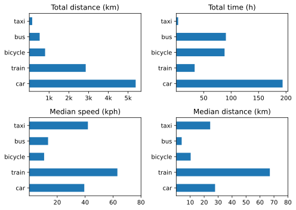
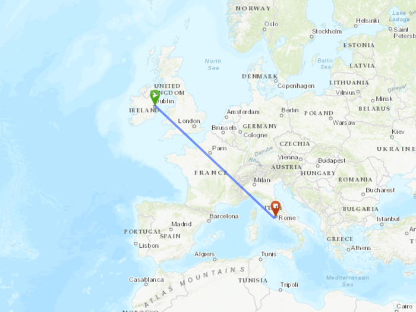
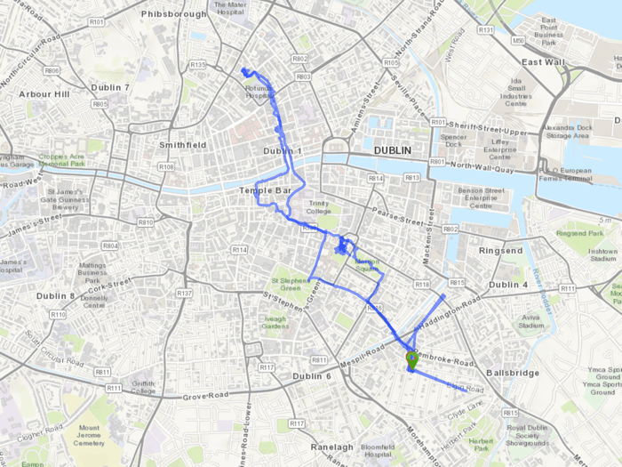

Here’s the thing: I honestly can remember only a single bad event during the entire year. It was very bad, and entirely personal, so I’m going to say no more. Even the medical procedures I underwent had happy outcomes, compared to what I was dreading. So, another great year.

===

We travelled, quite a lot, although not to anywhere new. Things flourished on the terrace. I continued to enjoy doing a lot less work for money and a lot more of my own thing. Eighty-five posts here chronicle some of those things, and if I had to single a couple out for special notice, they would be [a response](https://www.jeremycherfas.net/blog/ironrich-beans-are-not-ironrich) to the first academic paper I have written in a long, long time and the joy of [bringing my old Raleigh bicycle back into good riding condition](https://www.jeremycherfas.net/blog/ride-raleigh-ride).

{.center}

As far as online life goes, the best thing about the year was an in-person event. I know that sounds mad, but my visit to [Nürnberg in October](https://www.jeremycherfas.net/blog/indieweb-camp-nürnberg-2023) for border:none and IndieWebCamp was super enjoyable. The train rides there and back, the contact with friends old and new, the talks and hacking. All were extremely worthwhile and rewarding.

This was also the year in which I stopped using Ex-twitter and Facebook (although I have not deleted my accounts) and took the plunge into [Mastodon](https://indieweb.social/@etp). I’m starting to enjoy that more and more as I build up the people and hashtags I follow and engage with them directly. There are a few things I find tricky, like muting an account does not prevent their posts showing up when I search for a hashtag, but that may well be down to the app I use. I’m not yet doing any kind of automated POSSE to Mastodon, although I do a bit of cross-posting by hand. I’m aware of just how much automated cross-posting goes on, though, because I see the same thing there, on micro.blog, and in my feed readers. For now it is easier to scroll on by than decide on the one place I want to follow someone. If I know they are cross-posting absolutely everything, then I would prefer to follow them at their own site, but FOMO can get in the way of that.

## A Bit More Detail

As before, I think I will more or less follow the precedent set by last year’s organisation.

- [By the Numbers](#numbers)
- [Media Consumption](#media)
	- [Books](#books)
	- [TV & Movies](#tv+movies)
- [Eat This Podcast](#etp)
- [Moving Forward](#moving)
- [Staff of Life Stuff](#bread)
- [And the Rest](#more)

## By the Numbers ##

All these were extracted the old-fashioned way, either by letting Apple Health tell me or by keeping a running count.

- Steps per day 8735 (9096, 10,040, 9144)
- Active Energy 757 kcal per day (767, 823, 685)
- Resting Heart Rate 53 bpm (54, 54, 53)
- BP systolic 127–135 (119–135, 115-143, 120-147); diastolic 65–77 (69–77, 63-83, 55–81) (but fewer readings in 2023)
- Weight 87.17 (88.24, 86.45, 87.23)

Is there a meaningful decline in steps per day? Hard to know, really and right now it doesn't seem like that big a deal. I have set a reminder to take my blood pressure more frequently.

Medically, all good, and I am now, like many men my age, on an alpha-blocker, which has improved symptoms markedly and blessedly. IYKYK.

- Naps 175 (148, 181)
- HIIT 51 (90, 116)
- Read 199 (209, 203)
- Podcasts 208 (325, 440) logged.

I can’t quite put my finger on why I have not been keeping up with high-intensity interval training. I mean, obviously it is boring, but it has always been boring. I don’t do it away from home, despite the fact that it ought to be easy to keep it up on the road, and having been away a lot, there were some long breaks. I guess I just got out of the habit. The drop in podcasts could be the result of fewer walks (which I don’t track) or it could be that the average episode length is going up. Or both, but my bet is on fewer, longer episodes. Naps are a blessing.

## Media Consumption

Still keeping [a log](https://jeremycherfas.net/blog/what-ive-watched.html) through the year, and once again I am astonished to have almost no recollection of some things even though I wrote them down. Here are some choices I do remember.

### Books

Book of the year was very definitely **Cloud Cuckoo Land** by Anthony Doerr. (The Netflix adaptation of **All the Light We Cannot See** was one of the viewing highlights.) **The Dawn of Everything** by David Graeber and David Wengrow did a number on my preconceptions, for which I am extremely grateful. I suppose I could go back now and reread Sapiens in light of it, but life is too short. Other noteworthy fiction included **Small Things Like These** by Claire Keegan, **The Interpreter of Maladies** by Jhumpa Lahiri and **Billy Phelan’s Greatest Game** by William Kennedy. Nonfiction honourable mentions to: **Weatherland** by Alexandra Harris and **Christ Stopped at Eboli** by Carlo Levi.

### TV & Movies

**The Lying Lives of Adults**, set in Naples (on Netflix) is probably the one I would recommend that many people will not have seen. Slow Horses, Derry Girls, Diplomat, Inside Man and Lessons in Chemistry were all good and all probably seen by everyone. Among the few movies we saw, **A Quiet Girl** was my favourite. **Empire of Light** was very good, and all the better for having visited Margate in January. **Still**, a documentary about Michael J. Fox and Parkinson’s, was a very good documentary. We also watched **Citizen Kane** on Apple TV, prompted by an episode of In Our Time. It holds up so well, and there is so much more to see when you know what you are looking for. Very sad to see the end of **L’Engrenage**, or **Spiral**.

## Eat This Podcast

Eighteen [episodes](https://eatthispodcast.com) this year, the same as 2022, and 27 issues of [Eat This Newsletter](https://buttondown.email/jeremycherfas). It is all bubbling along nicely, not shooting up, not falling down. I didn’t do much extra in the way of promotion, except for joining Mastodon late in the year, and that did seem to result in a boost in people visiting the website. I decided to try and get over my snittiness about Big Podcasting and enter a couple of awards again in 2023. Nothing to lose except money and, fleetingly, self-esteem. We shall see.

## Moving Forward

Still recording various trips (but not walks) with [Overland](https://github.com/aaronpk/Overland-iOS) and still occasionally forgetting to end a trip at the end of the trip, which doesn't affect distance but does lower speed. Almost all are still underestimates. For the more frequent modes, though, thatgardly matters. Here are the overall summary statistics:

|Mode|Number|Total Km|Mean Kph|
|---|---:|---:|---:|
|boat|10|35|8.4|
|plane|2|0.0|0.0|
|taxi|8|147|41.9|
|tram|2|3.4|12.1|
|metro|2|43|24.8|
|car2go|5|36|12.8|
|train|15|2856|68.9|
|bicycle|48|799|11.0|
|car|97|5380|37.9|
|bus|102|524|13.3|
   
To note:

- Bicycle trips way up in number and distance. Happy.
- Still no separate records for e-bike rides, and I do not recall any.
- Those boat trips? *Vaporetti*, in Venice.
 

For further analysis, I focus on only those modes of transport that I used more than five times. Double the distance by car this year compared to last, but it is still a stupid luxury. Some good train rides too.

{.center}

I did clean up the janky Python scripts that produce the data and graphs, as promised a year ago, and they have worked well. A couple of anomalies, though, alerted me to some trips being duplicated. I had to go through by hand to eliminate them, and it didn’t make a huge difference overall. The task for 2024 is to incorporate a check for duplicates *before* the data get written to a file.

Being able to see a static map for any chosen day proved very useful during the year, so, as with 2022, lets look at the alpha and the omega of 2023.

{.center}

{.center}

## Staff of Life Stuff

About the same effort as 2022, with 125 loaves baked on 29 occasions, not counting specials just for us. At the start of the year I tried following the extremely detailed instructions for the basic sourdough from Maurizio Leo's *The Perfect Loaf*. It was OK, but only OK, and I haven't opened the book since. So, am I unadventurous or just content with what I have? You be the judge.

## And the Rest
Funny; among the intentions I listed here last year was "some sort of topic index to this site". I have absolutely no recollection what that might have been about and obviously did not do anything about it. Something beyond tags, obviously, but what? I know at one point while I was bringing all the old posts in I wrote a little thing to identify longer posts. Maybe I was thinking of curating those in some fashion. To do that for real I probably need to see an overall distribution of the length of posts, the better to set a cut-off length. Noted.

Onwards; I've taken almost a twelfth of a year to get to this point (but still marginally quicker than last year).

[comment]: # (Copy year to `compass-notebook`. Use `alltrips-allyear.ipynb` to build the CSV. `summary-stats.ipnb` to make the 4-way graph)