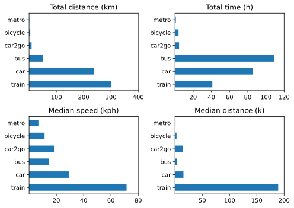
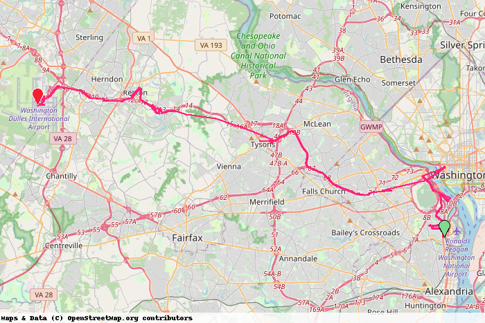
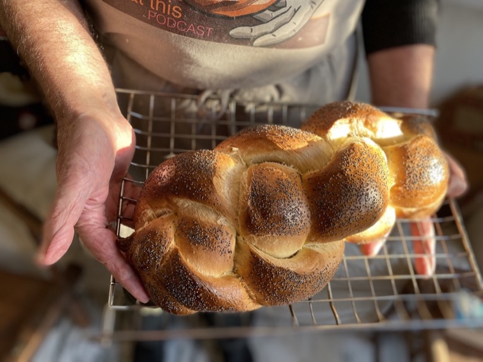

This is for a summary

===

# Much more about non-geeky stuff

As far as online life goes, the best thing about the year was an in-person event. I know that sounds mad, but my visit to [Nürnberg in October](https://www.jeremycherfas.net/blog/indieweb-camp-nürnberg-2023) for border:none and IndieWebCamp was super enjoyable. The train rides there and back, the contact with friends old and new, the talks and hacking. All were extremely worthwhile and rewarding.

This was also the year in which I stopped using Ex-twitter and Facebook (although I have not deleted my accounts) and took the plunge into [Mastodon](https://indieweb.social/@etp). I'm starting to enjoy that more and more as I build up the people and hashtags I follow and engage with them directly. There are a few things I find tricky, like muting an account does not prevent their posts shwoing up when I search for a hashtag, but that may well be down to the app I use. I'm not yet doing any kind of automated POSSE to Mastodon, although I do a bit of cross-posting by hand. I'm aware of just how much automated cross-posting goes on, though, because I see the same thing there, on micro.blog, and in my feed readers. For now it is easier to scroll on by than decide on the one place I want to follow someone. If I know they are cross-posting absolutely everything, then I would prefer to follow them at their own site, but FOMO can get in the way of that.

## A Bit More Detail

As before, I think I will more or less follow the precedent set by last year’s organisation.

- [By the Numbers](#numbers)
- [Media Consumption](#media)
	- [Books](#books)
	- [TV & Movies](#tv+movies)
- [Eat This Podcast](#etp)
- [Moving Forward](#moving)
- [Staff of Life Stuff](#bread)

## By the Numbers ##

All these were extracted the old-fashioned way, either by letting Apple Health tell me or by keeping a running count.

- Steps per day 8735 (9096, 10,040, 9144)
- Active Energy 757 kcal per day (767, 823, 685)
- Resting Heart Rate 53 bpm (54, 54, 53)
- BP systolic 127–135 (119–135, 115-143, 120-147); diastolic 65–77 (69–77, 63-83, 55–81) (but fewer readings in 2023)
- Weight 87.17 (88.24, 86.45, 87.23)

Is there a meaningful decline in steps per day? Hard to know, really and right now it doesn't seem like that big a deal. I have set a reminder to take my blood pressure more frequently.

Medically, all good, and I am now, like many men my age, on an alpha-blocker, which has improved symptoms markedly and blessedly. IYKYK.

- Naps 175 (148, 181)
- HIIT 51 (90, 116)
- Read 199 (209, 203)
- Podcasts 208 (325, 440) logged.

I can't quite put my finger on why I have not been keeping up with high-intensity interval training. I meran, obviously it is boring, but it has always been boring. I don't do it away from home, despite the fact that it ought to be easy to keep it up on the road, and having been away a lot, there were some long breaks. I guess I just got out of the habit. The drop in podcasts could be the result of fewer walks (which I don't track) or it could be that the average episode length is going up. Or both, but my bet is on fewer, longer episodes. Naps are a blessing.

## Media Consumption

Still keeping [a log](https://jeremycherfas.net/blog/what-ive-watched.html) through the year, and once again I am astonished to have almost no recollection of some things even though I wrote them down. Here are some choices I do remember.

### Books

Book of the year was very definitely **Cloud Cuckoo Land** by Anthony Doerr. (The Netflix adaptation of **All the Light We Cannot See** was one of the viewing highlights.) **The Dawn of Everything** by David Graeber and David Wengrow did a number on my preconceptions, for which I am extremely grateful. I suppose I could go back now and reread Sapiens in light of it, but life is too short. Other noteworthy fiction included **Small Things Like These** by Claire Keegan, **The Interpreter of Maladies** by Jhumpa Lahiri and **Billy Phelan's Greatest Game** by William Kennedy. Nonfiction honourable mentions to: **Weatherland** by Alexandra Harris and **Christ Stopped at Eboli** by Carlo Levi.

### TV & Movies

**The Lying Lives of Adults**, set in Naples (on Netflix) is probably the one I would recommend that many people will not have seen. Slow Horses, Derry Girls, Diplomat, Inside Man and Lessons in Chemistry were all good and all probably seen by everyone. Among the few movies we saw, **A Quiet Girl** was my favourite. **Empire of Light** was very good, and all the better for having visited Margate in January. **Still**, a documentary about Michael J. Fox and Parkinson's, was a very good documentary. We also watched **Citizen Kane** on Apple TV, prompted by an episode of In Our Time. It holds up so well, and there is so much more to see when you know what you are looking for. Very sad to see the end of **L’Engrenage**, or **Spiral**.

## Eat This Podcast

Eighteen [episodes](https://eatthispodcast.com) this year, the same as 2022, and 27 issues of [Eat This Newsletter](https://buttondown.email/jeremycherfas). It is all bubbling along nicely, not shooting up, not falling down. I didn't do much extra in the way of promotion, except for joining Mastodon late in the year, and that did seem to result in a boost in people visiting the website. I decided to try and get over my snittiness about Big Podcasting and enter a couple of awards again in 2023. Nothing to lose except money and, fleetingly, self-esteem. We shall see.

# Done to here

## Moving Forward

I made a much greater effort this year to record various trips (but not walks) with [Overland](https://github.com/aaronpk/Overland-iOS). Almost all are still underestimates; for sure I took at least two boat rides, there and back, and more than 2 flights, and 3 taxis is far too few. For the more frequent modes, though, that’s far less important. So here are the overall summary statistics.

|Mode|Number|Total Km|Mean Kph|
|---|---:|---:|---:|
|boat|1|33.5|23.6|
|plane|2|0.0|0.0|
|taxi|3|39.6|34.6|
|tram|4|10.7|10.8|
|metro|5|4.6|5.9|
|car2go|6|91.4|26.6|
|train|12|3013.3|91.8|
|bicycle|17|43.2|11.2|
|car|81|2375.6|31.7|
|bus|109|519.4|14.9|
   
To note:

- Bicycle includes e-bike; I suppose at a stretch I could isolate bicycle workouts, but I can’t be arsed.
- Distributions for train and car are markedly skewed, a few longer trips, many more shorter ones.
- That is also why average car speed is relatively slow
 

For further analysis, I focus on only those modes of transport that I used more than five times. Pretty pictures was more about learning to do so than about the extra insights that it would provide, although around 2500 km in the car suggests that it really is a luxury, sitting out in the rain and depreciating. What price convenience? A return trip to Budapest by train made a huge difference.

{.center}

All year, I’ve intended to clean up and fix the janky Python scripts that produce some of the transport information, but aside from a couple of quarterly efforts, I haven’t. I did, however, make a fair bit of progress in writing scripts to create a static map of days and trips within days. I can now conjure up a static map for any day or part thereof, although displaying specific trips still eludes me. So here are the alpha and the omega of the year.

{.center}

{.center}

All praise to the WMTA’s Silver Line.

The rich data I’m collecting are where I want to develop my Python abilities, although I would also like to recreate Bise with Python at some stage. Which reminds me, I’m collecting all that website data too, and ought to find a way to use and display it without letting it drive what I actually do on my sites.

## Staff of Life Stuff

[{.center}](challah.jpg)

Baked fewer loaves, less often, of fewer kinds: 128 loaves (not counting ones just for us) on 24 occasions, of 7 kinds. The big difference, I think, was a long break over the summer. The workflow was much the same as it had been in 2021, taking advantage of a long, cold retard of the bulk, which splits the work and makes it much more manageable. I didn't try anything really new this year, apart from the challah pictured above that I took to a Thanksgiving Dinner, nor do I see much point in doing so just for the sake of it. I also cut some breads out of the general rotation, though still made them for us from time to time, because simpler is good.

All in all, ready for 2023, with intentions: some sort of topic index to this site, more better Python, `$project` and probably some other things.

[comment]: # (Copy year to `compass-notebook`. Use `alltrips-allyear.ipynb` to build the CSV. `summary-stats.ipnb` to make the 4-way graph)