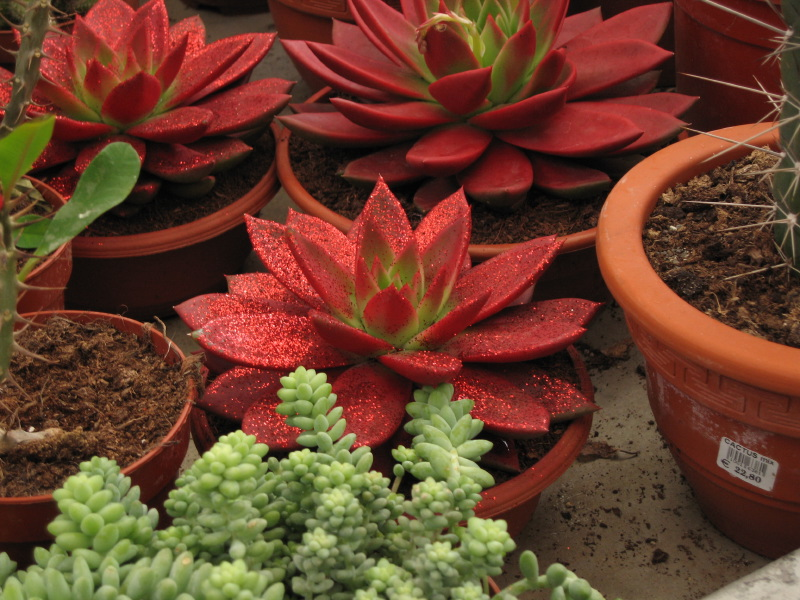

]{.center}

Perhaps you remember [the abomination of the blue(ish) Poinsettia](https://jeremycherfas.net/blog/ill-see-your-pshaw-and-raise-you-a-bah-humbug/)? Well, here’s another, actually foretold in that post, though it talked of gold rather than red.

Hard to credit, isn’t it? Spotted this last week at the local nursery. Left over from Christmas I expect. Why would anyone buy such a thing? It’ll surely leak glitter and end up looking pathetic. And how long is that one-- there were two, actually -- going to stay at the nursery? I almost bought them to put them out of their misery, but there are limits to even my generosity.
