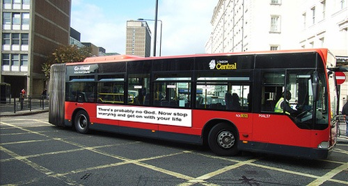

Exhibit A: In the UK, atheists weasel with “probably”. I don’t know why. Frankly, I don’t much care, because for me it is a done deal.

{.center}

That picture is a mockup, but there's [video at the Telegraph](https://web.archive.org/web/20090221202318/http://www.telegraph.co.uk/news/newstopics/religion/4177717/Atheist-bus-adverts-could-lead-to-watchdog-ruling-on-Gods-existence.html) that looks real enough to me.[^1]

[^1]: 2022-01-15: Gone the way of all Flash

Exhibit B: In Italy,[^fn1] _non c'e dubbio_.

{.center}

Only two buses, starting February 4th in Genoa. I love that they're being called Ateobus -- for autobus. Will it fly? We can but hope.

[^fn1]: I picked this up from [Sandwalk](https://sandwalk.blogspot.com/2009/01/atheist-buses-in-genoa.html), who got it from [Friendly Atheist] ~~http://friendlyatheist.com/2009/01/14/atheist-buses-in-italy/~~, and the comments there are a thing to behold. (2022-01-15: Or would be, if the Friendly Atheist hadn’t been through quite so many changes.)
