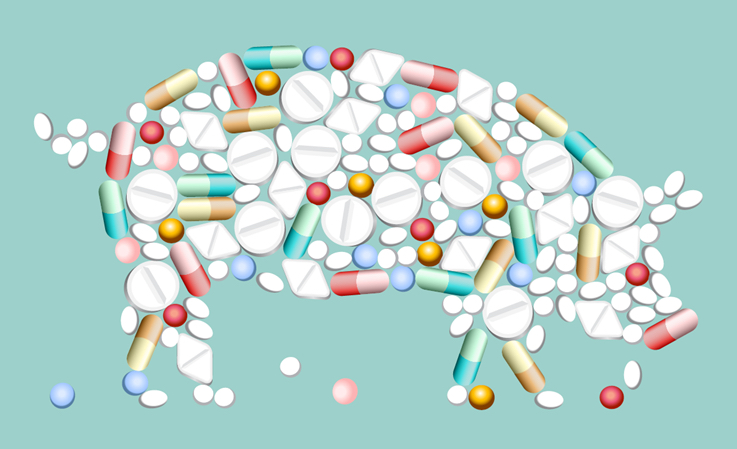

Only one thing makes it worth routinely feeding antibiotics to livestock; profit at any cost.

===

The introduction to a new report about [livestock antibiotic resistance in *Science*](https://science.sciencemag.org/content/365/6459/eaaw1944) states unequivocally that "There is a clear increase in the number of resistant bacterial strains occurring in chickens and pigs." It also, somewhat disingenuously in my view, says "It is unclear what the increase in demand for antibiotics means for the occurrence of drug resistance in animals and risk to humans."

{.center} 

It has been clear almost since the first deployment of antibiotics that resistance to them evolves, and that the more antibiotics are used, the more resistance we can expect. I well remember, back in 1982, [Stuart Levy](https://en.wikipedia.org/wiki/Stuart_B._Levy) warning me and anyone else who would listen that the world was already a dilute solution of Tetracycline. Levy died earlier this month, and yesterday's Washington Post carried a [very good obituary](https://www.washingtonpost.com/local/obituaries/stuart-levy-microbiologist-who-sounded-alarm-on-antibiotic-resistance-dies-at-80/2019/09/19/4011ea96-dae9-11e9-a688-303693fb4b0b_story.html). It gives the background to his ground-breaking research, published in 1976, that the routine use of antibiotics on a chicken farm resulted in resistant bacteria in people who lived nearby. I can imagine what he might say to this conclusion from this latest report:

> Globally, 73% of all antimicrobials sold on Earth are used in animals raised for food. A growing body of evidence has linked this practice with the rise of antimicrobial-resistant infections, not just in animals but also in humans. Beyond potentially serious consequences for public health, the reliance on antimicrobials to meet demand for animal protein is a likely threat to the sustainability of the livestock industry, and thus to the livelihood of farmers around the world.

Little-known fact: Levy's original study was funded by the Animal Health Institute, who hoped his results would support their view that routine antibiotics were useful and effective with no downside risks. As the Post's obituary notes:

> “Our study from 1976 was [and still is] the only prospective U.S. study on this, and industry didn’t want more studies,” Dr. Levy told the Scientist magazine in 2015. “They were upset that our data showed them to be wrong. This was highly political.”

Amen.

! Eat This Podcast's episode [Antibiotics and agriculture](https://www.eatthispodcast.com/antibiotics-and-agriculture/) examined this history of antibiotics on farms and one possible solution.

! Syndicated from [Eat This Podcast](https://www.eatthispodcast.com/antibiotic-resistance-in-livestock-high-and-growing/)