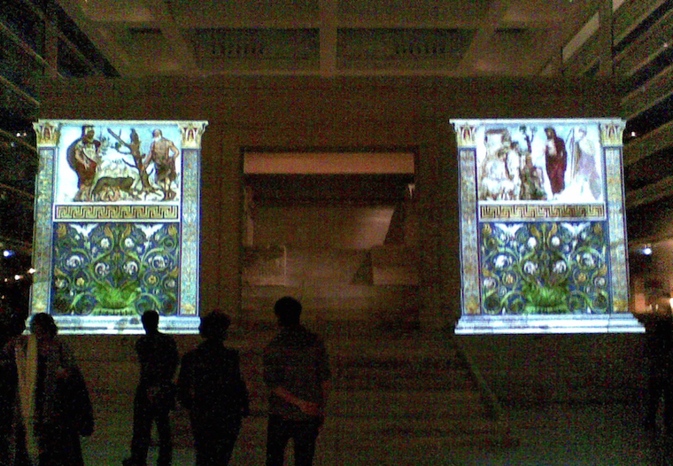
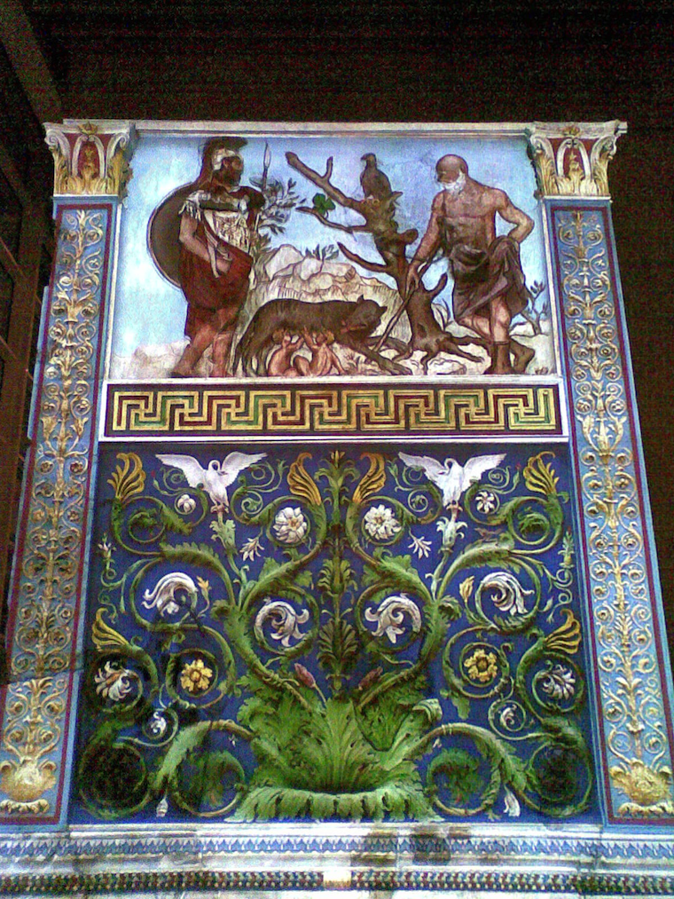
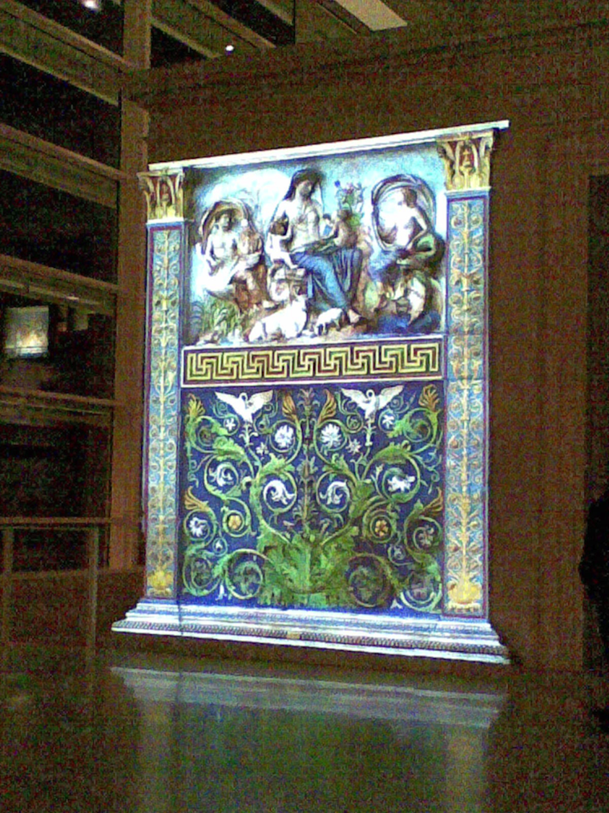
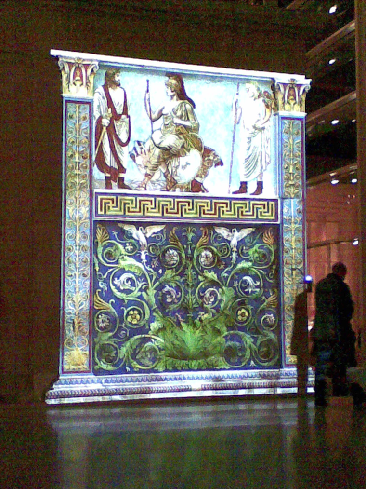

{.center}

Rome’s publicity often leaves a lot to be desired. So when friends invited me to the [Ara Pacis](https://en.wikipedia.org/wiki/Ara_Pacis) on Saturday night, I had no idea there was anything special going on. As we shuffled forward in the line (one person on duty to sell tickets for a special occasion) you could see something rather special. “[Scholars believe it would have been enhanced with color.](https://homepages.bluffton.edu/~sullivanm/italy/rome/arapacis/arapacis.html)” In the middle of one of the whitest buildings in Rome. Amazing.

Projectors, finely aligned, made the altar glow as if lit from within. Words simply don’t work. [^fn1]

{.center}

----

{.center}

----

{.center}

Thank you, Jane and Mark.

[^fn1]: Nor does my phone camera. 
