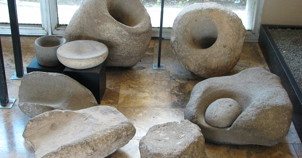

{.center}

Cultivation is not the same as domestication. Domestication involves changes that do the plant no good in the wild, but that make it more useful to the people who cultivate it. Seeds that don’t disperse, for example, and that aren’t all that well protected from pests and diseases. In this episode, where did people begin the process of domesticating wheat, and what set them on the road to agriculture.

<a href="https://www.eatthispodcast.com/our-daily-bread-04/" rel=canonical>Listen to At last: agriculture at Eat This Podcast.</a>