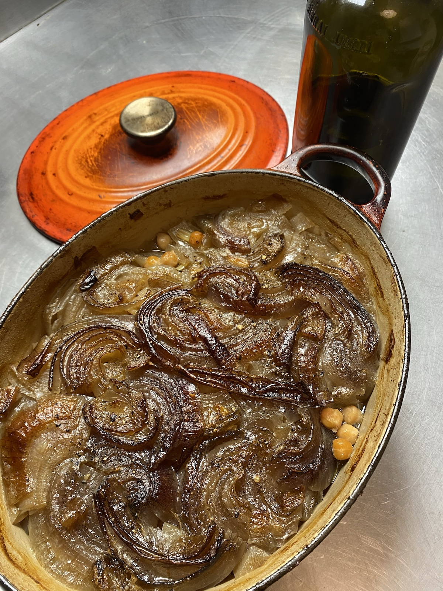

It is always such a treat when an online friend shares something and it turns out really well. So it was last week, when [Artemisia Vulgaris](https://social.coop/@CommonMugwort#.) offered up a simple-to-the-point-of-spare recipe for chickpeas and onions that, she said, “probably has changed very little since prehistory. This version is from the island of Sifnos, and was taught to my mother by my great aunt, who was from there.”

I love chickpeas, so of course I tried it.

===

Success beyond my imagining. Long slow cooking of the onions renders them meltingly soft and so sweet, a perfect foil for the earthier chickpeas. And the broth alone is delicious sopped up with some homemade bread. Here are her instructions, verbatim.

500 g dried chickpeas  
3-4 tbsp bicarbonate of soda  
6 large onions thinly and evenly sliced (I know it sounds like too much, it's not)  
salt & pepper to taste  
Cup or so olive oil (the tastier the better)  
Tap water to cover (see instructions)  

Soak the chickpeas overnight in 2 quarts of water in which the soda has been dissolved. Choose a deep bowl as the chickpeas will double in volume. Four hours before serving, preheat the oven to 200 C/390 F. Rinse the chickpeas thoroughly in plenty of running water, drain and put them in a lidded casserole dish, preferably ceramic. Stir in salt and pepper to taste. Add enough water that the chickpeas are about 1 cm below the surface.

Spread the sliced onions on top, they should form a layer 3-4 cm deep. Add the olive oil. It should cover the onions completely. Cover with the lid and cook for 15 minutes at 200 C, then lower the temperature to 160 C/320 F. In about 2 and a half hours, lift the lid to see what's going on. Every oven has its own peculiarities, so it's a good idea to check.

Most of the liquid should be gone and the surface beginning to brown. If there is still a lot of water, raise the temperature and finish cooking at 175 C/345 F. If the water has all evaporated, add half a cup of boiling water. Cook for another hour. It is done when the onions form a caramelized crust and there is only a bit of liquid left. Goes well with a sharp, acidic salad, such as cabbage and carrot, on the same plate.

Now, I don’t really like the effect that sodium bicarbonate has on chickpeas. I know people swear by it for making a smoother and arguably tastier hummus, but when the chickpeas are to remain whole, I prefer them somewhat more solid. I said as much to Artemisia and she encouraged me to have a go. So I did, exactly as written but no bicarb.

The only downside was that my casserole was a little too full. I had to go out for a bit and when I returned the house was full of smoke. I thought I had ruined everything, but it was only the olive oil on top, which had bubbled over and vaporised on the floor of the oven. The dish was fine.

With some windows open to give a through draft, the smoke cleared and any lingering smell was more than masked by the aroma of the dish. I served it with a plain green salad, well dressed, and it was a definite keeper. So much so that I asked Artemisia what I should call it.

> They are Sifnos Chickpeas (Sifnian? Sifnaic? From Sifnos?) or in my family, Aunt Mairi’s (it’s pronounced Mary’s) Sifnos Chickpeas.

After a little bit of further research, it seems to a kind of [revithada](https://en.wikipedia.org/wiki/Sifnos#:~:text=Revithada), which Wikipedia tells me is “chickpea soup cooked overnight in a wood-fired oven, in clay cooking pots called skepastaria”.