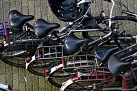

{.left} Back from a wonderfully restful holiday, and of course there is masses of catching up to do. At work, I managed to process all my emails -- more than 400 of them -- in a couple of hours, ruthlessly doing the 4D thing to Get Them Done; do it, delete, delegate, or delay. And the surprise is that there really aren’t that many that have been delayed. Tomorrow should see that clear.

Dealing with all the web pages that accumulate in my RSS reader was going to be trickier, but a slip of the finger fixed that. I marked them all read, by mistake. And while I may have missed something important, and there’s no going back, if it is really important instead of just being momentarily important it will probably surface again sometime soon.

Home is slightly trickier. There are photos to download, process and upload. Letters, real ones, that need answering. Other projects to get on top of. Blog posts to write ...

! flickr [photo](http://www.flickr.com/photos/photochiel/20451048/) by [Photochiel](http://www.flickr.com/photos/photochiel/), who subsequently disabled downloading, but when I first got the image, I come by it legit.
