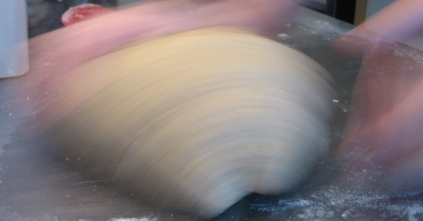

{.center}

Flour, water, salt and yeast; the basic ingredients of a loaf of bread. What happens when you mix them up and then heat them is a complex casade of chemistry, biology and physics. Most of the more subtle changes take time and can’t really be rushed. That’s why slow bread is better than fast bread in so many ways.

<a href="https://www.eatthispodcast.com/our-daily-bread-20/" rel=canonical>Listen to Back to Basics at Eat This Podcast.</a>