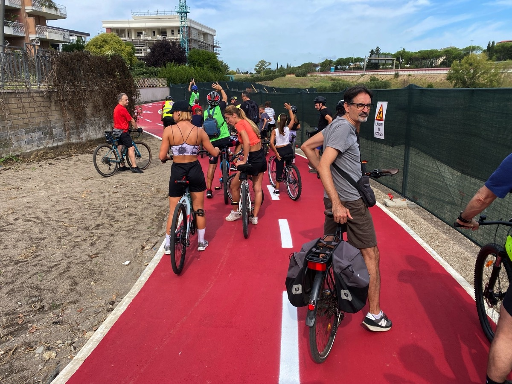
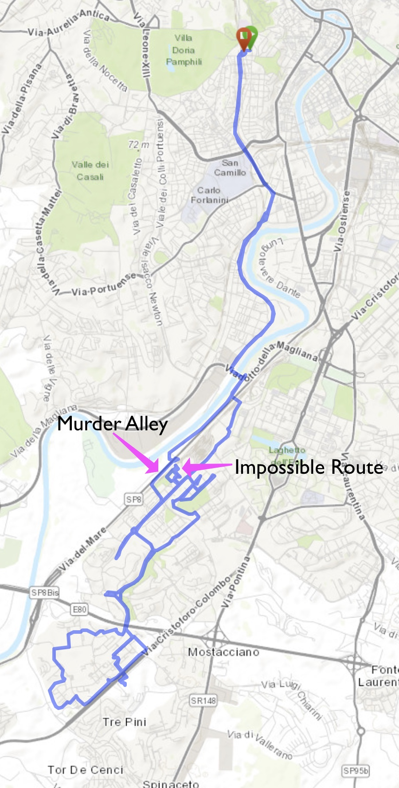
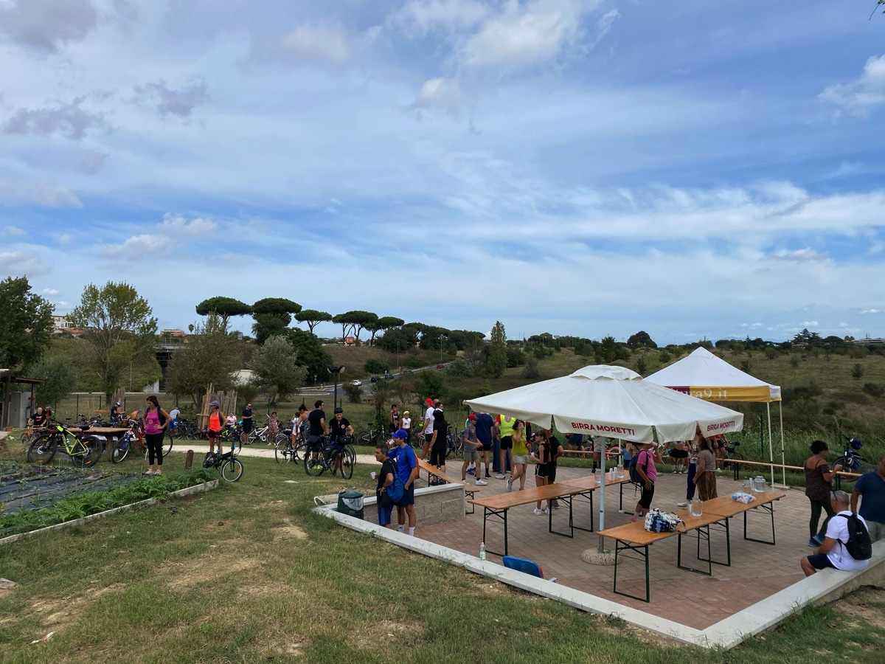

⏱️ 05:21 total (2:45 actual)   ⇄39.3km   ⌀14.3km/h   ↗?m   ↘?m

Yesterday there was a _Pedalata Solidale_ in an area to the south of Rome, organised by [Salvaiciclisti Roma](https://www.salvaiciclistiroma.it/). I belong to a different cycling organisation, but it seemed like a good idea to get out and about for the first time in ages. Also a test of a new navigation workflow. So I zipped over to [brouter.de](http://brouter.de/brouter-web/), got a route, downloaded the GPX, saved it to the cloud, opened it in OSMand, and was ready to roll.[^1]

[^1]: Sounds complicated but almost takes longer to type than to do and is so far the best method.

All good, until it told me to do a brief stretch of about 400 metres on an extremely busy two-lane highway that is routinely the site of horrendous crashes. So I hopped off the bike and walked. Rather safe than sorry, and all that.

Finally arrived at my destination to discover that it was not the destination I wanted. Somehow I had selected the wrong end point, and of course I hadn’t checked before setting out or I would have noticed that and the brief trip along murder alley.

In the end I joined up with the group, which was enjoying a breakfast courtesy of a local bar. Alas, the bar had not made any special arrangements to deal with the hordes and so was packed. I gave up on the breakfast and contented myself with helping a man fix the puncture on his daughter’s little bicycle, which felt good.

Then off we went, a good crowd, with local police holding up traffic as necessary, which also feels good every time.[^2] The area was completely unknown to me and there were loads of properly separated cycle paths. Of course a procession like that has to stop frequently to let the stragglers catch up — the police don’t want to be there all day — but on a social ride, who cares? There’s also the little matter of going up hills, when younger riders weave dangerously, but they aren’t too hard to avoid.

[^2]: I should note that on my way home drivers twice tried to kill me on roundabouts because God forbid they should wait a couple of seconds.

Finally we ended up at a rather fine community allotment garden, where there were cold drinks, warm pizza and endless speechifying. It always surprises me to see these oases and quite a lot of green space tucked in among the busy roads and apartment buildings.

It was good to rest in the shade, rehydrate and eat my peanut butter sandwich before heading for home. Of course, I had not been paying attention to our route, so I fired up Google Maps to get a route home and, once again, off I went. Again, there was unforeseen trouble, of a different kind. The route insisted I cross a railway line that was well fenced off. I checked OSMand; same deal. I fetched around for a bit trying to see whether there was a way, but eventually gave up and continued heading into town, knowing that I could pick up the route later.

Back home this morning I tried brouter.de again, just for fun. It avoided the railway line problem by sending me back along murder alley. Then I examined various maps in greater detail and there does indeed appear to be a cyclable tunnel under the railway line, although I could not see it on the ground. Google Maps even offers a helpful [Photo Sphere](https://www.google.com/maps/place/Sottopasso+Ciclabile/@41.825539,12.445108,3a,75y,347.64h,68.95t/data=!3m8!1e1!3m6!1sCIHM0ogKEICAgICq47TP0QE!2e10!3e11!6shttps:%2F%2Flh3.googleusercontent.com%2Fgpms-cs-s%2FAB8u6Hb8ZUY7b07dTx54h8Z_9n4Al6vafUhRg3BUYpidQY-M-qjh-vaN1AoN_GDmFARdM3wJm2eQJLB6UeEwAxBIYsgHaDadavHvrMPh6p5J7jnFfvAY1Pca34SymkRSB6Iw3sGBrdELCA%3Dw900-h600-k-no-pi21.047652622306117-ya199.5890474717276-ro0-fo100!7i5760!8i2880!4m6!3m5!1s0x13258b7e04963961:0xe5f178cc4151999d!8m2!3d41.8254069!4d12.4452091!16s%2Fg%2F11sdyr83d2!5m1!1e3?entry=ttu&g_ep=EgoyMDI1MDkxMC4wIKXMDSoASAFQAw%3D%3D) which, if anything, makes it seem entirely inaccessible. The tunnel is a little way off one of my normal exercise rides, so maybe next time I’ll make the effort to find it.

The main lesson I learned was not to blithely trust navigation maps, even open source ones. I need to add following the route onscreen before departure to the workflow.
