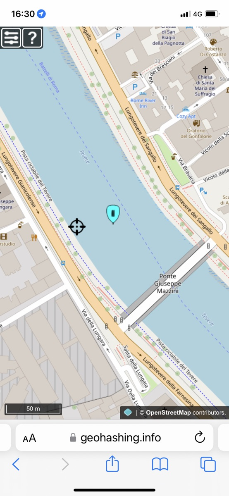
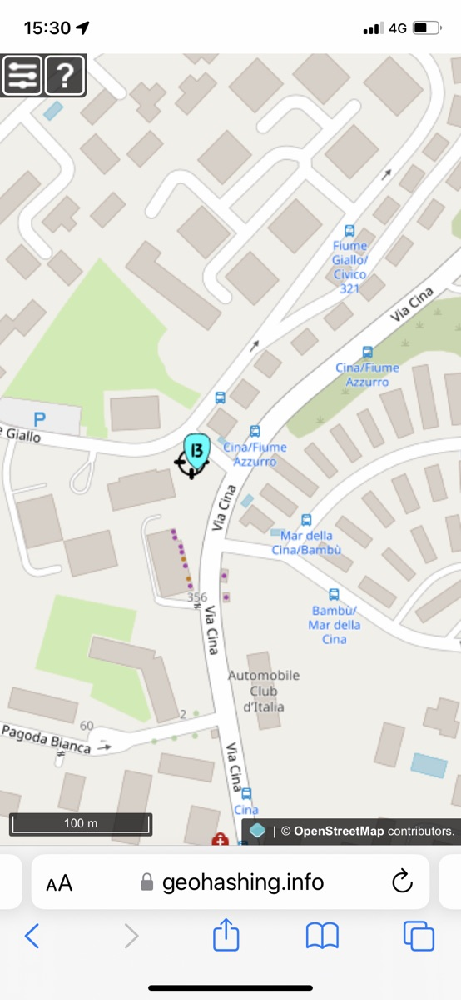

Two [geohashing locations](https://geohashing.site/) within cycling distance, on Saturday and today. My cup runneth over.

[The first](https://geohashing.site/geohashing/2023-11-11_41_12) was very, very close to home, about 1.5km as the crow flies. It was, alas, in the middle of the Tiber, so I was prevented from reaching the location by Mother Nature. But I'm counting it a win nevertheless. I rode the Brompton, knowing it was getting late and so not worth getting the Raleigh out and happy to get a bus up the hill.

{.center}

[Today's](https://geohashing.site/geohashing/2023-11-13_41_12) was somewhat further away, near the Grande Raccordo Annulare that generally circumscribes my rides. And the day was blessed with glorious sunshine, so of course I brought the Raleigh up from its subterranean resting place. This time, there was nothing to stop me reach the location itself, save for the inherent inaccuracy of my phone's geolocation.

{.center}

Two things to note. So infrequently do I set off to bag a geohash that I completely forget how to add my expedition to the wiki. No good idea how to remedy that. And having created a record on the geohashing wiki, I've no great enthusiasm for copying it all here. It might be nice to find some way to [PESOS](https://indieweb.org/PESOS) from the geohashing wiki, but it isn't urgent. I have the photos and maps and I could recreate the expedition report if I wanted to.
