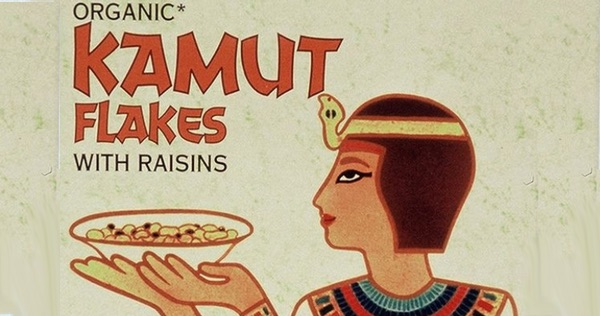

{.center}

Kamut® is a modern wheat — registered and trademarked in 1990 — with an ancient lineage. The word is ancient Egyptian, and the hieroglyphics may literally mean “Soul of the Earth”. More prosaically, “bread”. The story of its discovery and growing popularity says a lot about our hunger for stories. It is also quite capable of leading hard-nosed molecular biologists astray.

<a href="https://www.eatthispodcast.com/our-daily-bread-07/" rel=canonical>Listen to Bake like an Egyptian at Eat This Podcast.</a>