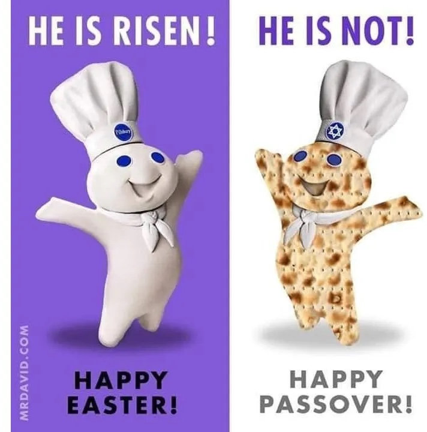

This time of year, approximately speaking, is ripe for investigating food and cultures, as in the episode [Celebrating Passover and Easter](https://www.eatthispodcast.com/passover/). With Passover just behind and Easter just ahead, I’m happy to resurrect some more ancient posts.

{.center .u-featured}

===

First, there’s Jeremy Parzen’s fascinating fifth Passover question: [why on this night do we drink Manischewitz wine coolers?](https://dobianchi.com/2017/04/05/best-kosher-wine-passover/), which links to his explanatory [Guide To Kosher Wine](https://www.houstonpress.com/restaurants/a-guide-to-kosher-wine-in-houston-for-passover-2017-9323648). OK, so the local references to Houston may be irrelevant to you, but I was fascinated to learn that “In order for wines to be kosher for Passover, the wines mustn’t come into contact with yeasts associated with grains (this is not the case for kosher wines consumed at other times of year)”. How do they do that? Jeremy doesn’t say.

Next, I’m hoisting this from a March 2006 blog post by the long-since vanished [grandpaboy](https://web.archive.org/web/20060416083902/http://grandpaboy.blogspot.com/2006_03_01_grandpaboy_archive.html), who I used to follow. In my search for the religious appropriation of Magic Marshmallow Crescent Puffs, this was the earliest online version I could find of the wonder of Easter baking (though it does not involve Magic Marshmallow Crescent Puffs).

<blockquote>

This is a wonderful recipe and a wonderful way to teach our children the wonder of Jesus on the cross. Please pass this on to all who believe and are saved! Amen

<h3>EASTER STORY COOKIES</h3>

To be made the evening before Easter. 
You need: 
1-cup whole pecans 
1 tsp. Vinegar 
3 egg whites 
pinch salt 
1-cup sugar 
zipper baggie 
wooden spoon 
tape 
Bible 

Preheat oven to 300 degrees (this is important-don't wait until you're half done with the recipe)! Place pecans in zipper baggie and let children beat them with the wooden spoon to break into small pieces. Explain that after Jesus was arrested He was savagely beaten by the Roman soldiers. 

Read John 19:1-3

Let each child smell the vinegar. Put 1 tsp. Vinegar into mixing bowl. Explain that when Jesus was thirsty on the cross, He was given vinegar to drink.

Read John 19:28-30

Add egg whites to vinegar. Eggs represent life. Explain that Jesus gave His life to give us life.

Read John 10:10-11

Sprinkle a little salt into each child's hand. Let them taste it and brush the rest into the bowl. Explain that this represents the salty tears shed by Jesus' followers, and the vile bitterness of our own sin.

Read Luke 23:27

So far, the ingredients are not very appetizing. Add 1cup sugar. Explain that the sweetest part of the story is that Jesus died because He loves us. He wants us to know and belong to Him.

Read Ps. 34:8 and John 3:16

Beat with a mixer on high speed for 12 to 15 minutes until stiff peaks are formed. Explain that the color white Represents --in God's eyes -- the purity of those whose sins have been cleansed by Jesus.

Read Isa. 1:18 and John 3:1-3

Fold in broken nuts. Drop by teaspoons onto wax paper-covered cookie sheet. Explain that each mound represents the harsh rocky tomb where Jesus' body was laid.

Read Matt. 27:57-60

Put the cookie sheet in the oven, close the door and turn the oven OFF. Give each child a piece of tape and seal the oven door. Explain that Jesus' tomb was sealed.

Read Matt. 27:65-66

GO TO BED! Explain that they may feel sad to leave the cookies in the oven overnight. Jesus' followers were in despair when the tomb was sealed.

Read John 16:20 and 22

On Easter morning, open the oven and carefully take out the cookies. Notice the pretty, cracked surface and emphasize to the children how wonderful the cookie will taste. Let them savor the anticipation of the sweetness in their mouths. When they are very excited to have a cookie and their mouths are watering, put a cookie on the counter and tap it with a spoon. The cookies are hollow! This represents all of the bitterness and sins that caused Jesus's suffering and how they vanish once Jesus rose from the tomb. The children may be sad when they learn that no cookies will be eaten this day, but the lesson they learn will go a long way in increasing their understanding of the sacrifice Jesus made for His people.

Read Matt. 28:1-9

</blockquote>
 
The original ends with “Share The Easter Cookie Story With Friends and Family,” so that’s what I am doing.

! I could not find the creator of the image; could be [David C. Perry](http://mrdavid.com/), I suppose. 
Syndicated to <a href="https://www.eatthispodcast.com/baked-indoctrination" class="u-syndication">Eat This Podcast</a>.
