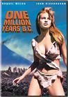

{.left} **Feet of Clay Dept:** Jim Watson, Nobel Laureate for his discovery of the structure of DNA has said that bicycles are extremely dangerous and ought to be banned. He has also pushed the origins of agriculture back to “caveman” days. Perhaps he was thinking of Raquel Welch, farmer and milkmaid? Actually, he didn’t say those things, not exactly, but no matter. Watson stars in a [Monsanto video]~~http://www.monsanto.com/biotech-gmo/asp/experts.asp?id=JamesWatson~~ that is alarmingly ill-informed,[^1] but the comments over at [Sandwalk](https://sandwalk.blogspot.com/2007/03/jim-watson-comments-on-gm-crops-and.html) (which tipped me off to the film) indicate that at least some people are not fooled.

I’ve got some Watson stories myself ...

[^1]: 2022-03-15: And tragically no longer available anywhere I could find … unless you know better.
